# Cool things to do in Athens

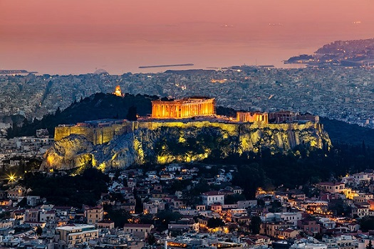

Photo owned by [ceoworld.biz](https://ceoworld.biz/)

Are you planning to visit Athens and searching for exciting activities to spend your time? This guide will help you find the most suitable way to explore the city depending on your taste!

## Menu
* [Food](#food) 🍕
* [Night Life](#nightlife) 💃
* [Tours](#tours) 🚶
* [Monuments](#monuments) 🗼
* [Activities](#activities) 🚴
* [Shopping](#shopping) 🎁

## Food

Here are the best places where you can enjoy the Greek food.

**The Doctors Wheelchair**

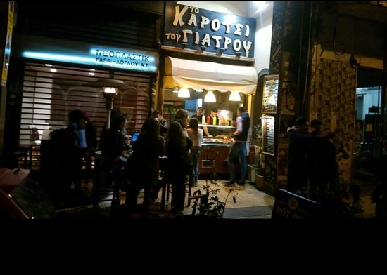

Even though it doesn't offer Greek recipes, "The Doctors Wheelchair"(or in greek "Το Καροτσάκι του Γιατρού") is one of the best Greek fast food restaurants you can find in the city center. Located in the area of Psiri, this little unique restaurant offers all the delicacies a normal fast food restaurant would offer but with the generous portioning of the Greeks. If you decide to visit, I suggest trying the "Loua Loua" sandwich. This magnificent gastronomical creation will probably keep you satisfied for the rest of the day, that is if you manage to eat it whole.
Address:[Μιαούλη 5, Αθήνα](https://www.google.gr/maps/place/Miaouli+5,+Athina+105+54/@37.97708,23.7233708,17z/data=!3m1!4b1!4m5!3m4!1s0x14a1bd23053dac0b:0xb0155bec7836bf32!8m2!3d37.97708!4d23.7255595)

*Photo retrieved from:* [Maxmag](https://www.maxmag.gr/city-guide/karotsi-toy-giatroy-docs-burger-bar/)

**TELI'S CHOPS**

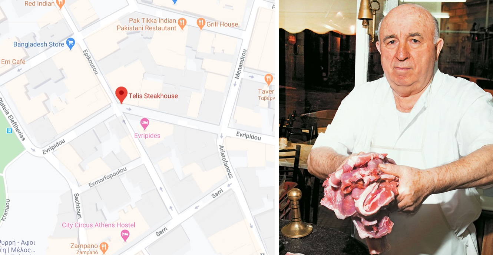

"TELI'S CHOPS", or in Greek, "ΤΑ ΜΠΡΙΖΟΛΑΚΙΑ ΤΟΥ ΤΕΛΗ", is a very good hidden tavern, with only one main dish. Chops. You get in, and they just ask you how many portions to bring on table. They also serve a legendary dish as an appetizer with tomato, peppers (spicy and not) & feta cheese, all grilled, just for free. Of course fried potatoes are served with the chops. Telis's tavern started its functioning since 1977 and is still the best of its kind. A portion costs almost 10 euros but it's totally worth its money (you satiate for good). But be careful not to be confused with the real tavern, because some unfair competitors have opened a chop-shop right next to the original, with the name "Telis"! The real one is the one on your right, as you see both taverns. Anyway, words are not enough to describe the taste. We suggest you going at least one time, and you won't lose. And just a tip of advice. If you go, when the order comes in table, do not post a picture of it on any social media or something like that. You will ruin it's magicness.

*Information retrieved from:* **My soul**
*Photo retrieved from:* [Oneman](https://www.oneman.gr/food-drink/sta-mprizolakia-toy-telh-afhneis-kai-thn-psyxh-soy/)

**LUKUΜΑΔΕΣ**

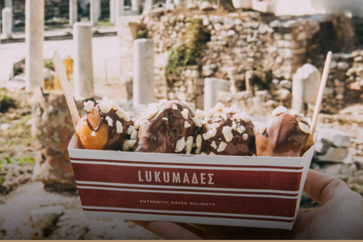

Loukoumades are little bite-sized fluffy sweet honey balls which are deep fried to golden and crispy perfection. They are served soaked in hot honey syrup or perhaps with cinnamon and garnished with chopped walnuts or you can have it with your favourite garnish. LukuΜΑΔΕΣ is a must place to visit so you can try our most traditional pastry!

*Information and photo retrieved from :* [Lukumades](https://www.lukumades.com/about)

**Nancy's Sweet Home**

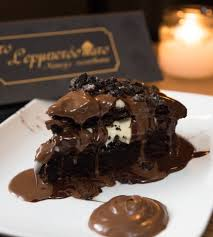

If you are a fan of sweets, that's the place for you! So many different options, but all so delicious! Being such a huge fan of chocolate, I strongly recommend it, but even if you are not so into chocolate you can find all kinds of sweets there! Juicy chocolate pies, hellish strawberry pies, southern kazan dip and many more are waiting for you. The most relaxing and sweet Candy Store in Athens is located at Psyri, really close to the Monastiraki Square.

*Information retrieved from:* [Nancy's Sweet Home](https://www.nancysweethome.gr/) |
*Photo retrieved from:* [LIFO](https://www.lifo.gr/team/peina/55522)

**Mparmpeekiou**

For meat lovers, Mparmpeekiou is heaven on earth. It started as a traditional-original stake house and later became an awarded burger house known for its huge portions, the wide variety of burgers and amazing flavors. Mparmpeekiou is located at Piraeus, Nea Smyrni and Chalandri. Don't forget to try out the most popular burger in the menu called *the brave one*, however you might win a special prize if you manage to eat the burger called *grandpa of the brave* which is equal to eating 8 entire burgers.

*Information retrieved from:* [Mparmpeekiou](http://www.mparmpeekiou.com/en/) |
*Photo retrieved from:* [Peiraias.me](http://peiraias.me/mparmpekiou/)

**Falafellas**

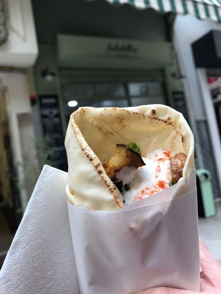

If you are in the mood for a good falafel, look no more! "Falafellas" is a small shop right in the heart of Athens(on the central street called "Aiolou").No matter the time you decide to visit, you will probably have to wait for a while, since there are always people waiting in line to have a taste of the delicious falafel. Don't worry though, the line moves on quickly and it is totally worth the wait. You can order the classic falafel, as much spicy as you want it, or you can go for the meatball one. Both of them are amazing!

*Information and photo retrieved from:* [iEfimerida](https://www.iefimerida.gr)

**Vlachika**

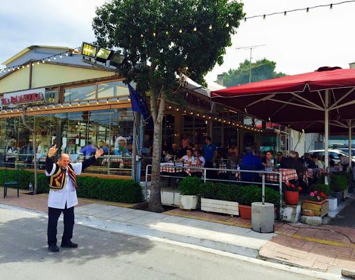

If you are a meat lover, then Vlachika is the perfect place to taste quality and delicious greek bbq. There they offer a large vriety of meat based dishes, so you can choose and eat any delicacies such us beef grilled steak, grilled lamb chops, pork on a spit (in greek γουρνοπούλα) and many other grilled dishes. In Vlachica you can also taste traditional greek dishes such as Mousakas, Pastitsio, Gemista etc. One the best dishes that you can taste in Vlachika is the lamb on a spit and Kokoretsi. Lamb on a spit and Kokoretsi are the most traditional, popular and delicious meals in Greece, so I strongly recommend them! Vlachika are located at the southern suburbs of Athens on a region called Vari.

*Information retrieved from:* [Vlachika](http://www.vlachika.gr/) |
*Image retrieved from* [Google](https://www.google.com/search?q=%CE%B2%CE%BB%CE%B1%CF%87%CE%B9%CE%BA%CE%B1+%CE%B2%CE%B1%CF%81%CE%B7&rlz=1C1GCEA_enGR858GR858&sxsrf=ALeKk02ujCpTbH21oujxW2QvTwGqKoBhww:1583665290144&source=lnms&tbm=isch&sa=X&ved=2ahUKEwi6hb_43IroAhVM-qQKHadhDfkQ_AUoAnoECBYQBA&biw=1920&bih=969#imgrc=iKBZxXqPB62tRM)

**Hoocut**

"Seeking a true dining experience will bring you to Hoocut. Here we make the real souvlaki right from the start, wanting to offer you a product with top quality raw materials, simple techniques and culinary thinking."
Someone whould probably think that you can't fit another souvlaki in the center of Athens but I'm sure you will understand the reason this restaurant made the list the moment you take the first bite! Great quality ingredients and different choices in the meat like beef or lamb will surely introduce you to a souvlaki flavour you never knew before. Hoocut is placed at Platia Agias Eirinis 9 in Athens (near Monastiraki square).

*Information retrieved from:* [Hoocut](https://hoocut.com/hoocut) |
*Image retrieved from* [Facebook](https://www.facebook.com/hoocut/photos/p.352925158604743/352925158604743/?type=1&theater)

## Night Life

Of course, when you visit Athens, you cannot skip its night life. Below, we have listed some of the best bars for you.

**A For Athens Cocktail Bar**

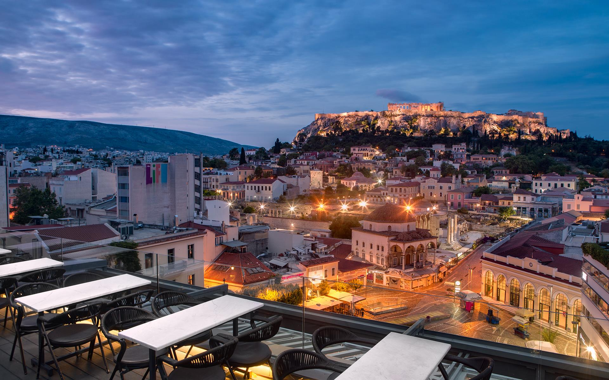

A For Athens is an ideal place to enjoy your house special cocktails at night! On the top floor, there is an urban terrace which creates a beautiful and fun atmosphere with a stunning view over the Acropolis and Monastiraki Square. It is placed right in the city center and is easily accessible, as the metro station is 2 minutes away on foot.

*Information retrieved from:* [TripAdvisor](https://www.tripadvisor.com.gr/Attraction_Review-g189400-d2665318-Reviews-A_for_Athens_Cocktail_Bar-Athens_Attica.html) |
*Photo retrieved from:* [A For Athens](https://aforathens.com/photos/)

**Lohan Nightclub**

If you like pop and trap music, this club is definitely a must for you. The huge space and the beautiful design will give you an unforgettable experience. In this club, you can have your favorite drinks, dance till the morning and enjoy the performance of the best DJ's in the world. It is near the city center, just a five-minute walk from the metro station "Keramikos"!

*Information and photo retrieved from:* [TripAdvisor](https://www.tripadvisor.com.gr/Attraction_Review-g189400-d11827483-Reviews-Lohan_Nightclub-Athens_Attica.html)

**Nalu**

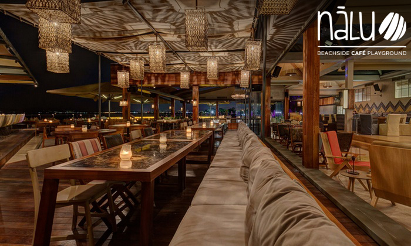

Nalu is an all day venue, next to the sea and open all year! It is located in Alimos and you can go there by bus or tram, but I would recommend by car since the place offers a free parking lot! A cozy environment offers its customers to enjoy themselves all day long. In the morning, you can enjoy your beverage and brunch with the unique sea view. In the afternoon, you can enjoy the breathtaking sunset next to the sea while drinking a glass of wine. And in the night, you can enjoy unique cocktails and drinks, while listening to your favorite music.

*Information retrieved from:* [Nalu](https://www.nalu.gr/en/home) |
*Photo retrieved from:* [Regroup](https://www.regroup.gr/default/388/deals/5870/nalu-menu/)

**Holy Spirit Cocktail Bar-Holy Spirit Beach Bar**

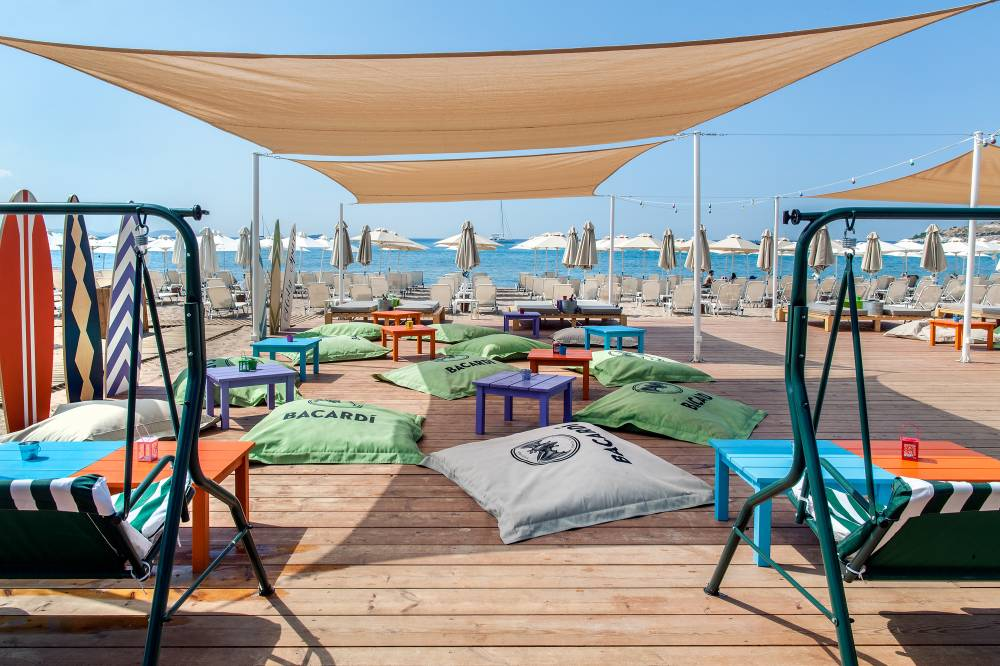

If you like cocktails and fancy drinks, then Holy Spirit is an ideal place for you. It is located at Laodikis 42 street in Glyfada, abouut 100 meters far from Nymfon Square. Holy Spirit offers a large variety of cocktails and drinks such as sour cocktails like Gimlet, bitter cocktails like Negroni, sweet cocktails like Mai Tai and salty cocktails like Margarita.

If you prefer cocktails only in summer, then Holy Spirit Beach Bar is a very beautiful place and the best choice that you have. Enjoy amazing and tasty cocktails at the beach of Varkiza with the sound of the sea waves. Holy Spirit Beach Bar is located at Varkiza Resort Yabanaki beach.

*Information retrieved from:* [Varkiza Resort](https://www.varkizaresort.gr/el_GR/stores/holy-spirit.html) |
*Photo retrieved from:* [Varkiza Resort](https://www.varkizaresort.gr/media/upload-files/cache/843/84346924fb1b5c02c2e105b1c65ddc6a_mg5443.jpg)

**Bouzoukia**

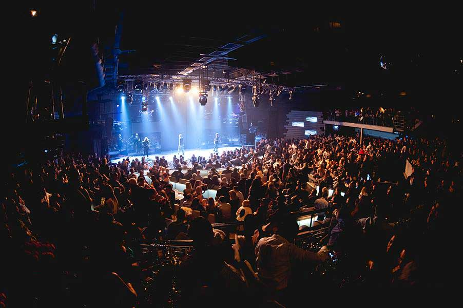

There are two types of bouzoukia, or pistes, which literally means ‘stages’. First there are the big ones. Think of them as a cross between an indoor concert and a club. You’ll find these venues around Iera Odos in the Gazi neighbourhood and Syngrou Avenue during the winter, and on Posidonos Avenue, which runs along the city’s southern coastline, in the summer. This is where you get to see the biggest stars of the Greek popular music scene: Sakis Rouvas, Anna Vissi, Antonis Remos, Despina Vandi, Giorgos Mazonakis, Paola, and so on.

Then there are the smaller, borderline cult stages, that we call skyladika, which literally means “where the dogs hang out.” There’s an interesting backstory here. Think of these as the B-list versions of the glamourous bouzoukia, where the singers, musicians and booze are second-class, where the flowers could have been stolen from a nearby cemetery, and where many of the customers are dodgy characters of the night.

*Information retrieved from:* [This is Athens](https://www.thisisathens.org/nightlife/live-music/night-out-bouzoukia)

## Tours

In order to enjoy the beauty of the city, you have to walk. So here are some tours worth doing.

**Monastiraki**

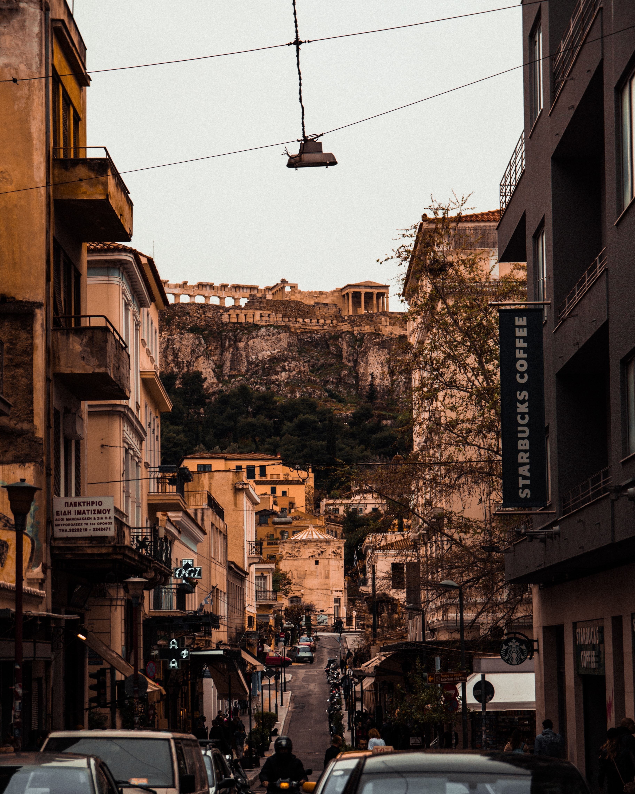

Photo by Adrian Dascal on Unsplash

Stroll around the picturesque Monastiraki and Plaka neighbourhoods
Feel the atmosphere of "old Athens" and get the touch of history on the pedestrian streets.
It’s hard to imagine how many different experiences can fit in two neighbourhoods of a city centre! Archaeological sites, little arrays, old beautiful houses, antique shops and pittoresque cafes live together in the neighbourhoods of old Athens.
Plaka is full of people, colours and music! With the “tavernas” (typical Greek restaurants), the little shops, the cosy cafés, you will feel like playing in a movie of the ’60s. Don't miss out!

**Kifissia**

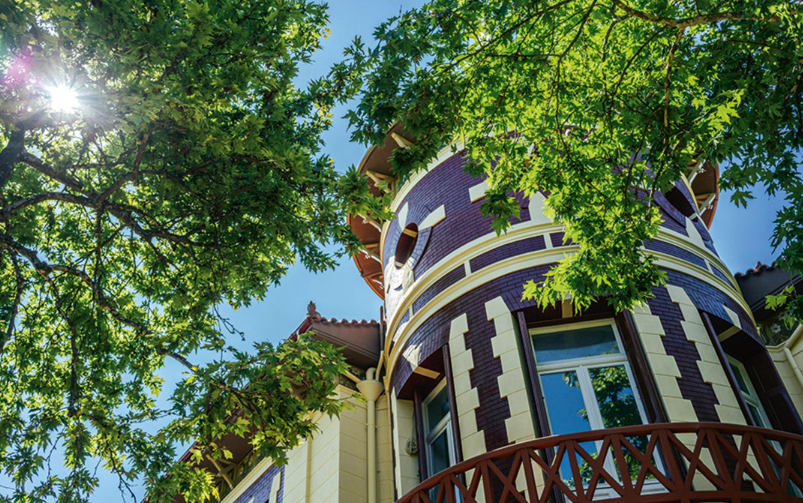

Just 14km from downtown Athens – or a short, 35-minute ride from Monastiraki on the electric railway (HSAP), Kifissia is a great choice for an action-packed day. Enjoy glamorous shopping, admire wonderful art, dine at a restaurant and study a fascinating mix of centuries-old mansions. Here you can relish cool air, abundant greenery and a sense of nonchalant affluence that is light years away from the sometimes overwhelming chaos of the city center. While Kifissia’s boutiques may be the exclusive domain of the elite, there is an abundance of things to discover and explore beyond shopping.

*Info retrieved from:* [Kifissia](https://www.greece-is.com/kifissia-the-northern-aristocrat/)

**Koukaki**

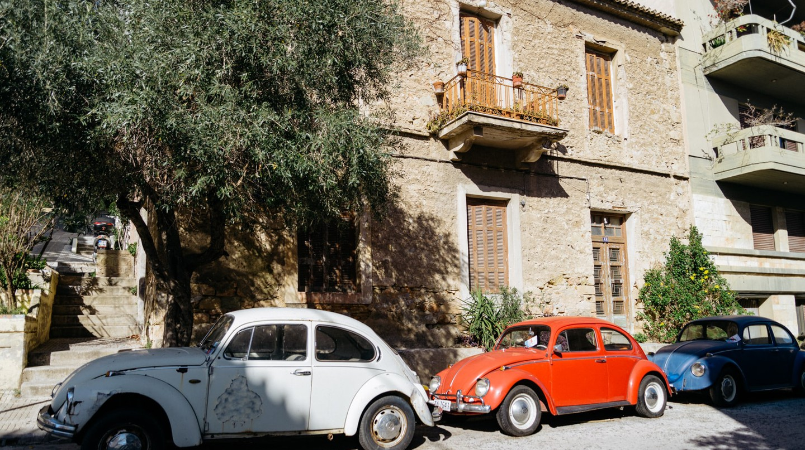

This residential neighborhood, located at the foot of the Acropolis and the Filopappou Hill, is a combination of authenticity, convenience and entertainment. One of Koukaki’s highlights is the blend of architectural styles it contains. With its mismatch of neoclassical houses, low-rise buildings dating from the 1930s and post-1970s apartment blocks, Koukaki includes small shops, traditional restaurants, art galleries, museums and colorful bars and cafes. After a leisurely stroll around the streets, you can be sure to always find a café with a couple of tables and chairs set up outside where we suspect your coffee break will quickly turn into an impromptu lunch. Whether you are on your own or with friends, looking to celebrate a special occasion or simply want to hang, Koukaki has it all.

*Information and photo retrieved from:* [Culture Trip](https://theculturetrip.com/europe/greece/articles/a-walk-around-koukaki-neighbourhood-in-central-athens/)

**Thisseio**

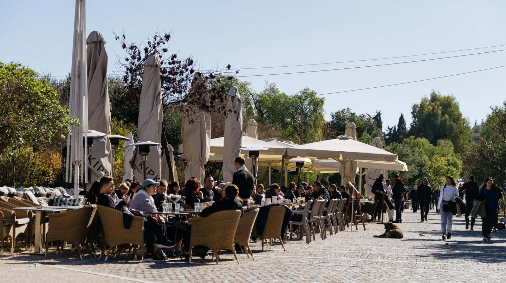

Picture-perfect Thisseio is an ideal district for relaxing strolls and evening walks with views over century-old monuments. In addition to Filopappou Hill, the pedestrian street of Dyonisus Areopagitou and the lines of street vendors selling crafts and jewelry are just some of the highlights. Green, quiet and charming, Thisseio has also its fair share of cafés, bars and restaurants, where during the warm days, you can find a quiet corner on a terrace to enjoy a great book or an intense conversation with your friends. And just when you thought you knew everything about Thisseio, it surprises you with its small collection of museums, such as the Herakleidon Museum of Visual Arts, housed in a neoclassical mansion, or the "Stoa of Attalos Museum", located in the Ancient Agora.

*Information and photo retrieved from:* [Culture Trip](https://theculturetrip.com/europe/greece/articles/a-walking-guide-to-thisseio-neighbourhood-athens/)

**Filopappou Hill**

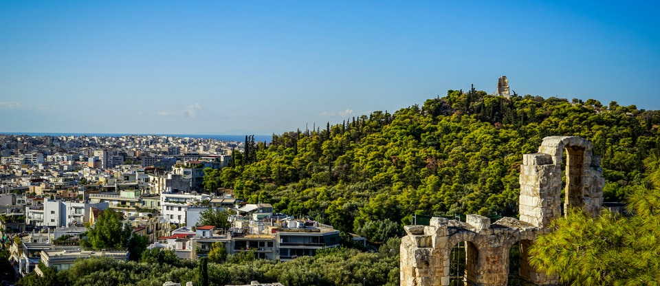

Filopappou hill, also called the Hill of the Muses, is the perfect spot for a stroll escpecially at sunset! The hill offers a breathtaking view to the Saronic Gulf and of course and a really advantaging point to take a photo of the Acropolis. Of course there is a lot of history hidden in this hill. The monument of Filopappos, which identifies the hill, was built between AD 114 and 116 in honour of Julius Antiochus Filopappos, a prominent Roman consul and administrator.

*All info retrieved from:* [Lonely Planet](https://www.lonelyplanet.com/greece/athens/attractions/filopappou-hill/a/poi-sig/1008076/359421)

## Monuments

Athens is famous for its history and its numerous monuments and museums, you don't want to miss that part.

**Acropolis**
>The most famous historical monument in Greece

The Acropolis of Athens is the most famous historical monument in Greece. It was constructed in the mid 5th century BC, also known as the Golden Century of Athens. Although the most famous building on the Acropolis is the Parthenon, there are many other buildings, like the Propylaea, the Erechtheion and the Temple of Athena Nike. The Acropolis was entirely made of the finest Pentelic marble and by the best craftsmen of the era. Along the centuries that followed, it was largely destroyed by wars. The greatest destructions were in 1687 by a Venetian gun, and in 1816 when Lord Elgin removed many parts of the Parthenon frieze.

*All info retrieved from:* [Greeka](https://www.greeka.com/greece-history/monuments/)

**Parthenon**

This magnificent temple on the Acropolis of Athens was built between 447 and 432 BCE in the Age of Pericles, and was dedicated to goddess Athena, the city's patron. It was designed by architects Iktinos and Kallikrates, while the sculptor Pheidias supervised the entire building process and conceived the temple's sculptural decoration and [chryselephantine statue of Athena](https://en.wikipedia.org/wiki/Athena_Parthenos). The temple is considered to be the epitome of Classical Greece.

*Information retrieved from:* [VisitGreece](http://www.visitgreece.gr/en/culture/monuments/parthenon) |
*Photo of Parthenon retrieved from:* [Wikipedia](https://en.wikipedia.org/wiki/Parthenon)

**Erechtheion**

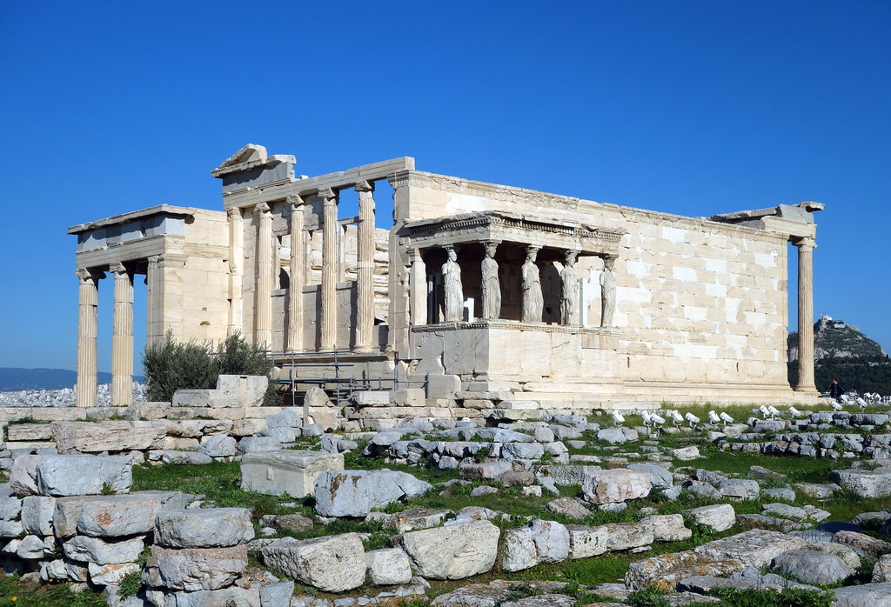

The Erechtheion is an ancient Greek temple located on the north side of the Acropolis. The temple was erected in 421-406 BC and was dedicated to both Athena and Poseidon. In particular, the eastern part of the building was dedicated to Athena Polias, while the western part served the cult of Poseidon-Erechtheus and held the altars of Hephaestus and Voutos, brother of Erechtheus.

On the north side of the temple, there is the famous "Porch of the Maidens", with six sculpted female figures (Caryatids) serving as supporting columns. Five of them are in the Acropolis Museum and the last one in the British Museum; those on the building are casts.

*Information retrieved from:* [VisitGreece](http://www.visitgreece.gr/en/culture/monuments/erechtheion) |
*Photo of Erechtheion retrieved from:* [Wikipedia](https://en.wikipedia.org/wiki/Erechtheion)

**Temple of Poseidon**

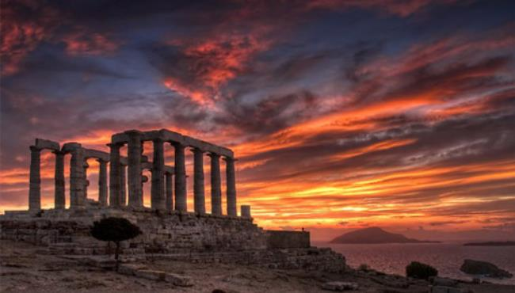

*Photo retrieved from:* [GreekTravelPages](https://www.gtp.gr/TDirectoryDetails.asp?ID=14990)

One of the most stunning views all over Greece as well as a monument difficult to forget. Located at the southernmost tip of Attica the Temple of Poseidon is build to impress and educate us about history. Stories around this temple involve King Menelaus who stopped there on his way back from Troy and King Aegeus who had the unfortunate fate of drowning on that spot, thus giving his name to the Aegean Sea.

Organizing a trip to the Temple of Poseidon is worth your time but making the most of your trip is also important by swimming on the beach, underneath the monument, getting an astonishing experience of clear blue waters.

*Information retrieved from:* [VisitGreece](http://www.visitgreece.gr/en/culture/archaeological_sites/the_archaeological_site_of_sounio)

## Activities

Athens has many things to do for athletics individuals too! From walking to our famous mountains to skydiving!

**Kartland**

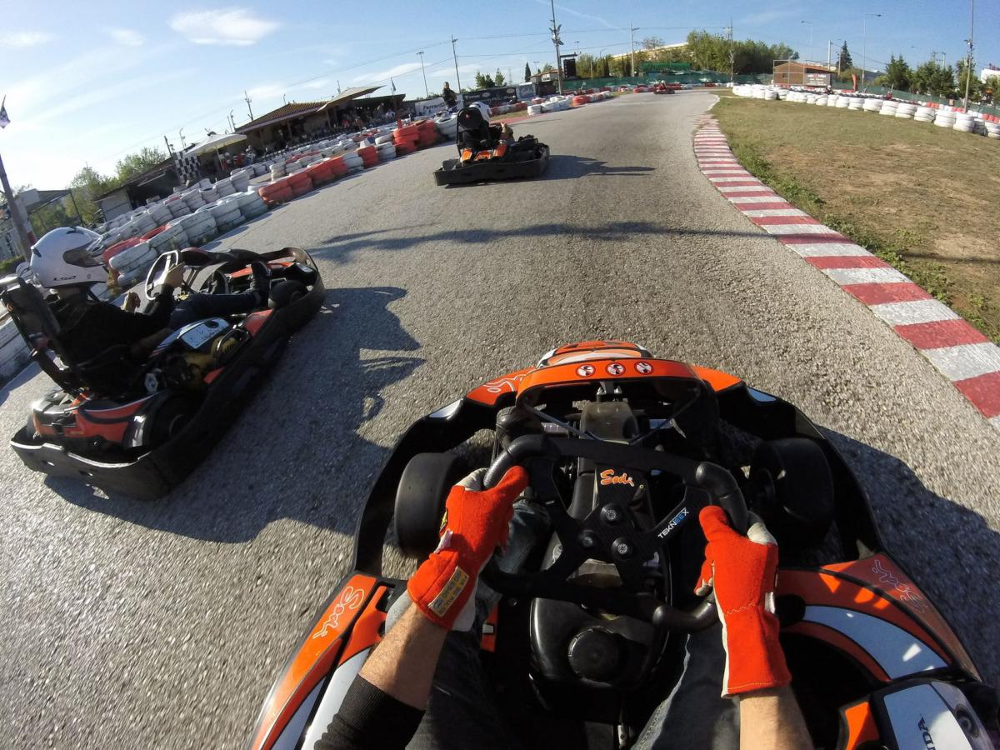

One of the most exciting things that you can to do in Athens is Kart, the small cars like you drive at F1!! It is the 1st track in Greece to implement a self-timer system and light board in every kart! Please note that all drivers are required to wear a helmet and a disposable cap through the helmet for hygiene reasons. Kartland is located in Pallini, Athens and is easily accessible by car or by public transportations, using the metro and the bus.

*All info extracted from:* [Kartland](https://kartland.gr/)

**Hiking**

Going hiking is a great way to explore and get to know Athens! There are a lot of places ideal for a hiking adventure!
1. Sounion National Park

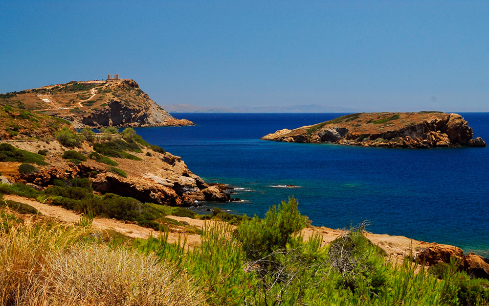

Sounion is most known for Poseidon's mighty temple and its magnificent sunsets. Lying about 50km south-east of Athens, the  Sounion National Park hosts relics of ancient silver, lead and zinc mines, as well as cave fossils unique to the whole of Greece. Inside the park you will find a magnificent and easy trail which starts near the Agios Konstantinos village(you will usually find a parking spot there), it surrounds the dramatic Chaos gulch (a collapsed ancient cave), it continues briefly on tarmac and then the view opens and you can see the city of Lavrion as well as the islands of Makronisos and Kea. The path arrives at the church of Agia Triada, where you will find natural spring water. From there, a dirty old road will lead you to the ancient mines' washing plants and tanks and then you will come across Kitsios cave. Finally, north of Poseidon's temple you will fing the rocky outcrops of Mavro Lithari and Vasilopoula.
*Information retrieved from:*[AthensInsider](https://athensinsider.com/3-top-hikes-around-athens/)|
*Photo of Sounion National Park retrieved from:* [AthensInsider](https://athensinsider.com/3-top-hikes-around-athens/)

2. Ymittos Mountain

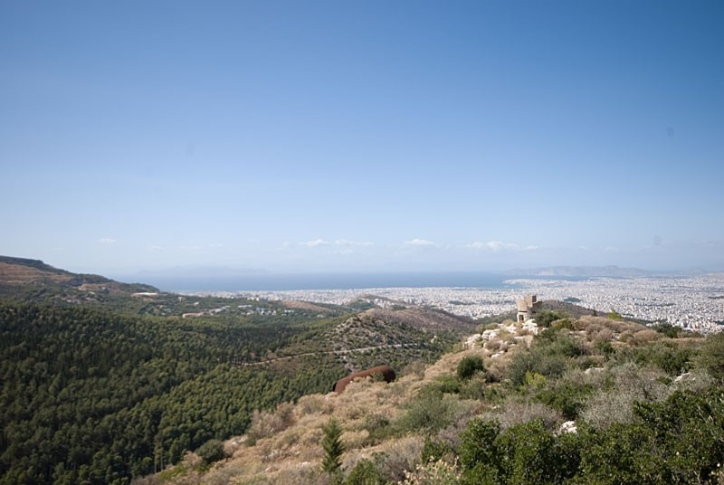

It has great view and if you climb up, you will be able to see the port of Piraeus on the one side and the Athens airport on the other side Mount Ymittos in Athens, Attica, is covered with beautiful pine forest, impressive caves, historic monasteries and many marked footpaths and is very close to the center of Athens. It is also a great birdwatching area and attracts an impressive number of bird species.

If interested in finding specific trails in the mountain [Click here!](https://www.wikiloc.com/trails/hiking/greece/attica/ymittos)

*Information retrieved from:* [Protothema](http://en.protothema.gr/hiking-in-ymittos/)

**Lycabettus hill**

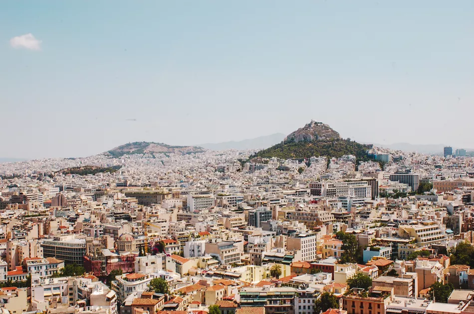

Lycabettus hill is the highest point in the center of Athens. At the top of the hill, you can dine in the restaurant and visit the church of Agios Georgios. There are 3 ways to reach the top:

1. Climbing up the hill on foot, which is a long climb but not so difficult one.
2. Cable car if hiking and climbing isn't your thing. I would recommend that you take the cable car to get to the top and then go down on foot.
3. Car by following Lycabettus ring road, you will reach the end of the road with a huge parking lot and lot of people hanging out there. Next to the parking lot is the open theater of Lycabettus, where concerts and theatrical performances take place during summer.

No matter what you choose, you must be sure for one thing. You will enjoy the breathtaking panoramic view of Athens.

*Information retrieved from:* [Lycabettus](https://www.lycabettushill.com/)|
*Image retrieved from*[Tripsavvy](https://www.tripsavvy.com)

**Paintball Park Malakasa**

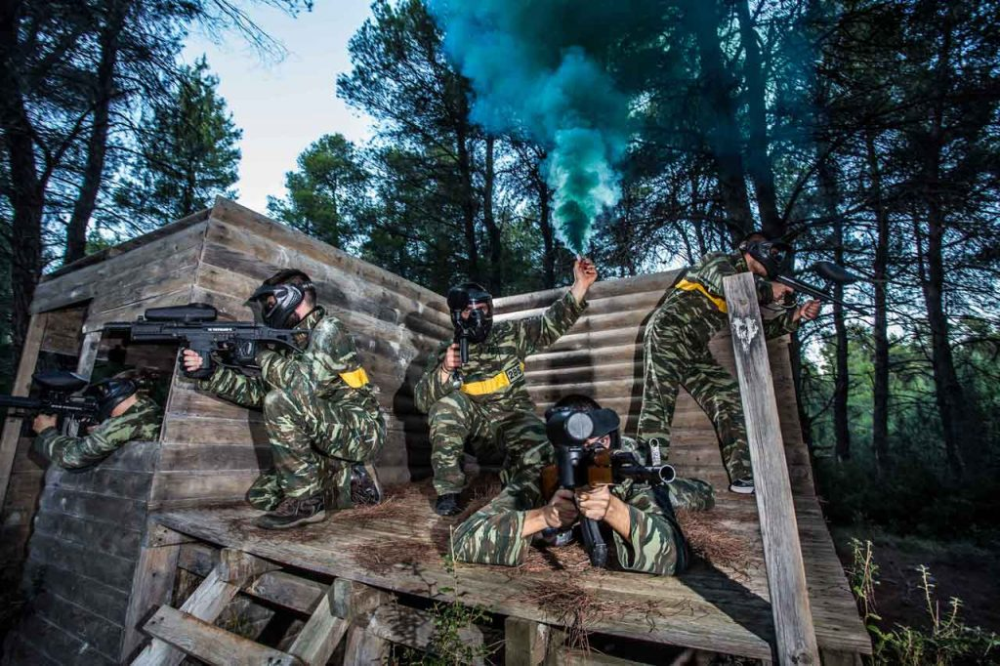

If you are in Athens and you are searching for an alternative way of fun, this is the best place for you! Paintball Park Malakasa is an area of 150 acres and it constitutes the biggest Paintball Park of Greece and one of the biggest if not the biggest in Europe. There are two independent areas, Paintball NEST, for friends and teams, and Paintball Park EVENT, for kid's parties and events. Both areas promise to offer moments of action, decompression and joy to any type of groups. The park is ready to serve every paintball scenario needed in order to fulfill its customers to the fullest! You will find formed forest fields, with army jeep, bulwarks, bridges, wooden homes, small rivers, fortresses, minefields, sniper position, observatories, stone village etc. It is only 25 minutes far from Athens and you can access the area by car, bus or train. More details on how to get there in the link below!

*All info extracted from:* [Paintball Park](https://www.paintball-park.gr/)

## Shopping

There are a lot of places where you can go shopping in Athens! Below you can find the most famous places!

**The Mall Athens**

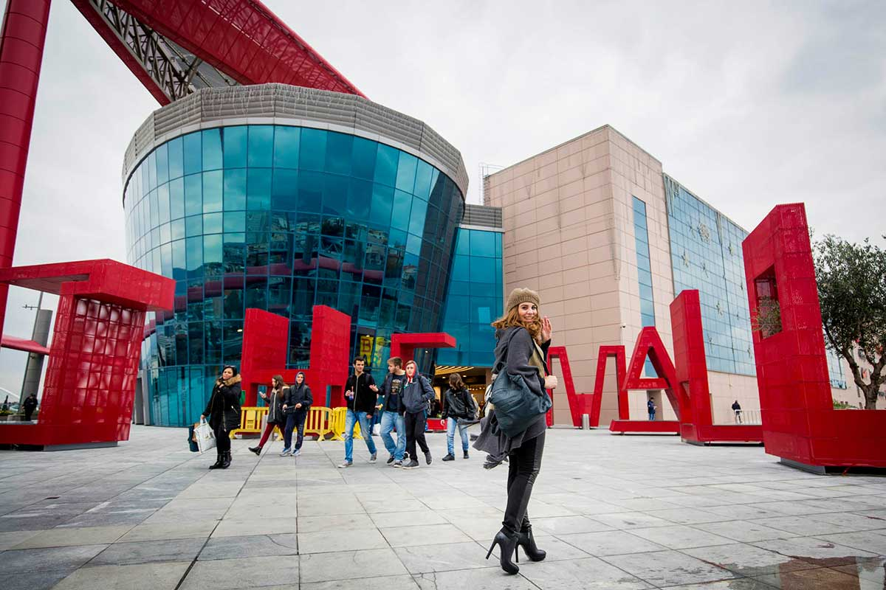

Of course, if you want to go shopping in Athens you can't miss the largest shopping mall in the city! This mall brings together over 200 different shopping, entertainment and dining options. In its 4 floors you can find many famous brands, restaurants, cafés, cinemas and entertainment spaces for the whole family. It is easily accessible, since you can go there by car with a huge parking lot or public transportations using the train at the Stop Neratziotissa you just climb up the stairs.

*All info retrieved from:* [MallAthens](https://themallathens.gr)

**Ermou street**

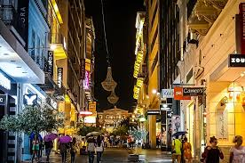

*Photo taken from:* [gtp](https://news.gtp.gr)

Ermou street is 1,5 km long road in the center of Athens, connecting Kerameikos with Syntagma Square through Monastiraki. The east side of the street is a pedestrian road and a very busy shopping street. Walking down Ermou street you cannot only shop from famous brands that are located there but you can also find a lot of places to rest, such as restaurants and cafés. Since it is located in the city center it is easily accessible through public transportations(bus, metro, train). You can also visit Ermou street before or after sightseeing in the city center, like Acropolis or Parthenon, and you can dine in the Monastiraki or Syntagma Square, that are really close to the street.

*Info retrieved from:* [Wikipedia](https://en.wikipedia.org/wiki/Ermou_Street_(Athens))

**Golden Hall**

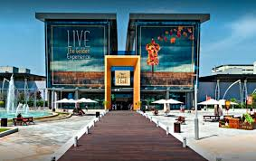

Right on Kifissias Avenue (Maroussi),Golden Hall is an extraordinarily beautiful building of three tiers which houses more than 140 fashion stores, making it perfect for anyone looking for a shopping experience. What makes it unique is that at Golden Hall, one can find the most expensive brands (Ralph Lauren, Carolina Herrera etc.) and visit fast fashion stores (Zara, American Eagle etc) at the same place. Aside from the fashion stores, you will come across various cafeterias and restaurants that can satisfy all tastes, such as Wagamama, Ben & Jerry's, TGI Friday's and many more. There is also a huge uderground car park with more than 1500 spaces, so you won't have to wonder around looking for a parking spot. However you can also get there using public transportation.

*Photo taken from:* [Ypodomes](https://ypodomes.com/)|
*Info retrieved from:* [Golden Hall](https://goldenhall.gr)
