# Cool things to do in Athens

Photo owned by [ceoworld.biz](https://ceoworld.biz/)

Are you planning to visit Athens and searching for exciting activities to spend your time? This guide will help you find the most suitable way to explore the city depending on your taste!

## Menu
* [Food](#food) 🍕
* [Night Life](#nightlife) 💃
* [Tours](#tours) 🚶
* [Museums](#museums) :mortar_board:
* [Monuments](#monuments) 🗼
* [Activities](#activities) 🚴
* [Shopping](#shopping) 🎁
* [Fun and Games](#fun) 😁
* [Art and Culture](#artAndCulture) :art:
* [Accomodation](#accomodation) 🏨
* [Full day trips](#fullDayTrips) :car:
* [Beach](#beach) 🏄

## Food

Here are the best places where you can enjoy the Greek food.

**The Yard**

Even though this place beauty is hidden in its simplicity and secrecy, more people should know about it. The Yard ("Αυλή" in Greek) is a hidden paradise in the area of Psiri at he center of Athens. This difficult to find place is a traditional Greek restaurant that is bound to remind you of the 60s and is located at [Agiou Dimitriou 12](https://www.google.gr/maps/place/Agiou+Dimitriou+12,+Athina+105+54/@37.9796252,23.7237424,17z/data=!3m1!4b1!4m5!3m4!1s0x14a1bd249853df6d:0x84aa56a003836200!8m2!3d37.9796252!4d23.7259311) in Athens.

*Photo retrieved from:* [Olive Magazine](https://www.olivemagazine.gr/εστιατόρια-bars/η-ελένη-ψυχούλη-βγαίνει-τσάρκα-στου-αν/)

**Fairytale**

If you love fairytales and sweets, then you should definitely visit this "sweet" magical place in Nea Filadelfeia. Fairytale is the ideal place where sweets and tales are mixed in a unique way. Its owners love all Disney heroes and they have visited all of Disneys parks. Drawing their inspiration from their visits, Fairytale was created, but its not only looks as all sweets served are a work of art both in appearance and taste. Fairytale's exact location is at [Tripia 33](https://www.google.com/maps/dir//38.0354,23.736193/@38.035337,23.666058,12z), Nea Filadelfia.

*Photo retrieved from:* [Bovary](https://www.bovary.gr/city/9159/sto-fairytale-sti-nea-filadelfeia-goneis-kai-paidia-kanoyn-oyra-gia-na-mpoyn-se-ena)

**Brooklyn the taste factory**

Even though most restaurants in Athens are located in or near the center, this particular one is not. Brooklyn the taste factory is an American-like burger house with a wide variety of burgers and similar choices. Since it is located in Greece though, be careful because all portions are really generous. The stuff is polite and the restaurant's environment fits the needs of a modern college student while also being family friendly. If you actually decide to visit, keep in mind that you might wait a bit for the order to arrive since most things are made in the spot. You will find this excuisite burger house at [Parnithos 183](https://www.google.com/maps/dir//Brooklyn+the+taste+factory/@38.0956957,23.6684965,12z/data=!4m8!4m7!1m0!1m5!1m1!1s0x14a1a1bf5027c02b:0xfed9f2dd897b3bd9!2m2!1d23.7385365!2d38.0957165) in Acharnes.

*Photo retrieved from:* [Brooklyn the taste factory](https://brooklyn-the-taste-factory.business.site)

**LIVADIA**

You are hungry. You are near Omonoia and in 30 minutes you have a presentation with your team at AUEB. You need a classic OG souvlaki-kalamaki, and suddenly... BOOM. "Livadia" or "ΣΟΥΒΛΑΚΙ Η ΛΕΙΒΑΔΕΙΑ" is right next to you. Just the Holy lemon, bread/pita, fried potatoes and  kalamaki-Pork. Functioning since 1965, serves traditional tastes made with joy and meraki. The ingredients are handmade with no extra flavors & add-ons. Just the clean tasteful meat. Of course you can order a cold drink if you are thirsty or a colorful salad to accompany your appetite.   

*Information and photo retrieved from:* [Η ΛΕΙΒΑΔΙΑ](https://www.souvlaki-leivadia.gr/)

**The Doctor's Wheelchair**

Even though it doesn't offer Greek recipes, "The Doctor's Wheelchair" (or in Greek "Το Καροτσάκι του Γιατρού") is one of the best Greek fast food restaurants you can find in the city center. Located in the area of Psiri, this little unique restaurant offers all the delicacies a normal fast food restaurant would offer but with the generous portioning of the Greeks. If you decide to visit, I suggest trying the "Loua Loua" sandwich. This magnificent gastronomical creation will probably keep you satisfied for the rest of the day, that is if you manage to eat it whole. Its exact location is at [Miaouli 5](https://www.google.gr/maps/place/Miaouli+5,+Athina+105+54/@37.97708,23.7233708,17z/data=!3m1!4b1!4m5!3m4!1s0x14a1bd23053dac0b:0xb0155bec7836bf32!8m2!3d37.97708!4d23.7255595) in Athens.

*Photo retrieved from:* [Maxmag](https://www.maxmag.gr/city-guide/karotsi-toy-giatroy-docs-burger-bar/)

**TELI'S CHOPS**

"TELI'S CHOPS", or in Greek, "ΤΑ ΜΠΡΙΖΟΛΑΚΙΑ ΤΟΥ ΤΕΛΗ", is a very good hidden tavern, with only one main dish. Chops. You get in, and they just ask you how many portions to bring on table. They also serve a legendary dish as an appetizer with tomato, peppers (spicy and not) & feta cheese, all grilled, just for free. Of course fried potatoes are served with the chops. Telis's tavern started its functioning since 1977 and is still the best of its kind. A portion costs almost 10 euros but it's totally worth its money (you satiate for good). But be careful not to be confused with the real tavern, because some unfair competitors have opened a chop-shop right next to the original, with the name "Telis"! The real one is the one on your right, as you see both taverns. Anyway, words are not enough to describe the taste. We suggest you going at least one time, and you won't lose. And just a tip of advice. If you go, when the order comes in table, do not post a picture of it on any social media or something like that. You will ruin it's magicness.

*Information retrieved from:* **My soul**
*Photo retrieved from:* [Oneman](https://www.oneman.gr/food-drink/sta-mprizolakia-toy-telh-afhneis-kai-thn-psyxh-soy/)

**LUKUΜΑΔΕΣ**

Loukoumades are little bite-sized fluffy sweet honey balls which are deep fried to golden and crispy perfection. They are served soaked in hot honey syrup or perhaps with cinnamon and garnished with chopped walnuts or you can have it with your favourite garnish. LukuΜΑΔΕΣ is a must place to visit so you can try our most traditional pastry! You will find it at [Aiolou & Agias Irinis 21](https://www.google.gr/maps/place/LUKUMAΔΕΣ/@37.9769125,23.7254017,17z/data=!3m1!4b1!4m5!3m4!1s0x14a1bd3cd2b5c53f:0xeadb95bb43cf5947!8m2!3d37.9769125!4d23.7275904) in Athens.

*Information and photo retrieved from :* [Lukumades](https://www.lukumades.com/about)

**Choureal**

Ever wanted a nice desert? CHOUREAL is a perfect place to eat a beloved desert , a homemade profiterole. The difference of course is that these profiteroles are made in ‘a la minute’ fashion which means they are being made by the time you visit this place.They fragrant choux are always freshly baked.During your order you can fill it either with silk cream or hand-made ice cream and you can top it with your favorite things!

*Information and photo retrieved from:* [Choureal](https://www.choureal.gr/)

**Nancy's Sweet Home**

If you are a fan of sweets, that's the place for you! So many different options, but all so delicious! Being such a huge fan of chocolate, I strongly recommend it, but even if you are not so into chocolate you can find all kinds of sweets there! Juicy chocolate pies, hellish strawberry pies, southern kazan dip and many more are waiting for you. The most relaxing and sweet Candy Store in Athens is located at Psyri, really close to the Monastiraki Square.

*Information retrieved from:* [Nancy's Sweet Home](https://www.nancysweethome.gr/) |
*Photo retrieved from:* [LIFO](https://www.lifo.gr/team/peina/55522)

**Mparmpeekiou**

For meat lovers, Mparmpeekiou is heaven on earth. It started as a traditional-original stake house and later became an awarded burger house known for its huge portions, the wide variety of burgers and amazing flavors. Mparmpeekiou is located at Piraeus, Nea Smyrni and Chalandri. Don't forget to try out the most popular burger in the menu called *the brave one*, however you might win a special prize if you manage to eat the burger called *grandpa of the brave* which is equal to eating 8 entire burgers.

*Information retrieved from:* [Mparmpeekiou](http://www.mparmpeekiou.com/en/) |
*Photo retrieved from:* [Peiraias.me](http://peiraias.me/mparmpekiou/)

**Falafellas**

If you are in the mood for a good falafel, look no more! "Falafellas" is a small shop right in the heart of Athens(on the central street called "Aiolou").No matter the time you decide to visit, you will probably have to wait for a while, since there are always people waiting in line to have a taste of the delicious falafel. Don't worry though, the line moves on quickly and it is totally worth the wait. You can order the classic falafel, as much spicy as you want it, or you can go for the meatball one. Both of them are amazing!

*Information retrieved from:* [iEfimerida](https://www.iefimerida.gr) |
*Photo retrieved from:* [Skyscanner](https://www.skyscanner.net/trip/athens/restaurants/falafellas)

**Vlachika**

If you are a meat lover, then Vlachika is the perfect place to taste quality and delicious greek bbq. There they offer a large variety of meat based dishes, so you can choose and eat any delicacies such us beef grilled steak, grilled lamb chops, pork on a spit (in Greek γουρνοπούλα) and many other grilled dishes. In Vlachica you can also taste traditional Greek dishes such as Mousakas, Pastitsio, Gemista etc. One the best dishes that you can taste in Vlachika is the lamb on a spit and Kokoretsi. Lamb on a spit and Kokoretsi are the most traditional, popular and delicious meals in Greece, so I strongly recommend them! Vlachika are located at the southern suburbs of Athens on a region called Vari.

*Information retrieved from:* [Vlachika](http://www.vlachika.gr/) |
*Photo retrieved from:* [Google](http://www.vlachika.gr/wp-content/uploads/2010/07/11149389_1582772561974345_6388572603203465498_n.jpg)

**Kostas Souvlaki Shop**

It may be hidden in a small passage of Mitropoleos street which does not grab your attention at first sight, but judging from the large queue of people waiting outside for a souvlaki you can understand that something unique is located there. There is the small shop of Kostas, whose traditional souvlaki is worshipped not only by Athenians but also from a lot of tourists, since its fame has reached a lot of tourist guides about Athens.

*Information retrieved from:* [Efimerida](http://www.iefimerida.gr/) |
*Photo retrieved from:* [Taxi and Driver](https://taxianddriver.gr/pou-tha-fame-to-kalutero-soublaki-tis-athinas-ston-kwsta/)

**Cookoomela**

Cookoomela is the perfect place to eat a vegan souvlaki in Athens. Cookoomela's menu remains small and at the same time complete. Five wrapped skewers, potatoes and a salad. Skewers' main ingredients are mushrooms or lentil meatballs, which are enriched with a variety of healthy, fresh and handmade ingredients such as authentic Sicilian recipe tomato sauce, avocado, vegan mayo, mustard, organic vegan yogurt sauce, vegan cheese, salad and bbq sauce.

*Information retrieved from:* [Lifo](http://www.lifo.gr"/) |
*Photo retrieved from:* [Google](https://i2.wp.com/www.madameginger.com/wp-content/uploads/2019/03/Cookoomela-Exarcheia-1.jpg?quality=92&fit=1310%2C900)

**Yiasemi**

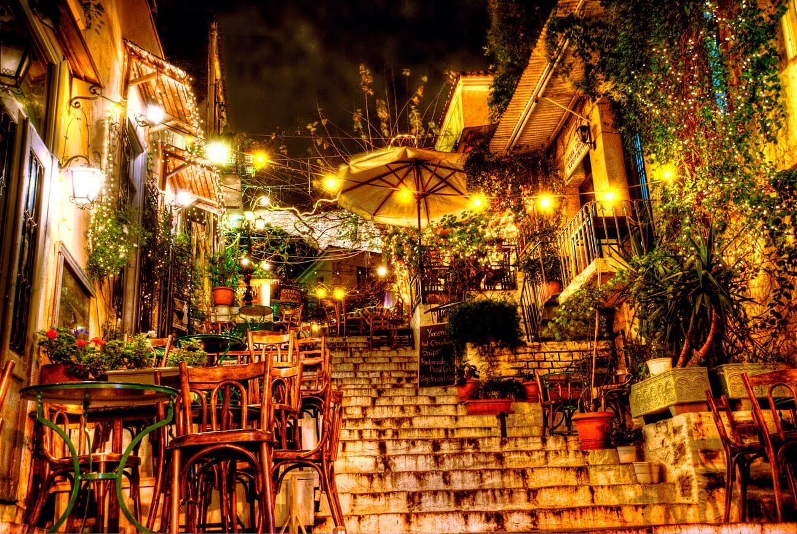

Yiasemi is a funky cafe and bistro, located in the historic city center of Athens, at Mnisikleous street. It is quite well know for its
picturesque setting, as it offers sitting options on the famous stairs of Mnisikleous street, that go all the way to the hill of the Acropolis and took the name of the ancient architect Mnisikli.

*Photo retrieved from:* [Travel to Athens](https://www.traveltoathens.eu/item/cafe-yiasemi/)

**Hoocut**

"Seeking a true dining experience will bring you to Hoocut. Here we make the real souvlaki right from the start, wanting to offer you a product with top quality raw materials, simple techniques and culinary thinking."

Someone would probably think that you can't fit another souvlaki in the center of Athens but I'm sure you will understand the reason this restaurant made the list the moment you take the first bite! Great quality ingredients and different choices in the meat like beef or lamb will surely introduce you to a souvlaki flavour you never knew before. Hoocut is placed at Platia Agias Eirinis 9 in Athens (near Monastiraki square).

*Information retrieved from:* [Hoocut](https://hoocut.com/hoocut) |
*Photo retrieved from:* [Facebook](https://www.facebook.com/hoocut/photos/p.352925158604743/352925158604743/?type=1&theater)

**Karaflas Original**

You don't want to miss out the best creperie in town! Karaflas Original is placed in Zografou and you can get there by bus. I strongly suggest you go there and totally recommend you take a sweet crepe. My favourite with chocolate and biscuit but you can have everything you want even if its not a sweet crepe. The place offers you a lot of ingredients you can choose from, so feel free to get there and choose after you have seen all possible choices. The best part about this place and the one thing that makes it so unique is that whatever you choose to have, the ingredients will not only be inside the crepe but also above it. So make sure when you get there that you are starving in order to eat the whole thing. If you are not ,  you can share it with someone else and still be too much for both of you.

*Photo retrieved from:* [Facebook](https://www.facebook.com/%CE%9A%CF%81%CE%B5%CF%80%CE%B5%CF%81%CE%B9-%CE%9A%CE%B1%CF%81%CE%B1%CF%86%CE%BB%CE%B1%CF%82-%CE%BF%CF%81%CE%B9%CF%84%CE%B6%CE%B9%CE%BD%CE%B1%CE%BB-1633501440053949/)

**Kiveli**

Located on Saint George square near Kipseli and Patission street, Kiveli is a traditional Greek restaurant with amazing food at decent prices. Just a 7-minute walk from Athens University of Economics and business, this restaurant is the perfect gathering place for students right after their Software Engineering in Practice lectures.

Recommended dishes by frequent visitors are the Drunken Chicken Fillets, the french fries and of course, Dakos Salad.

For a reservation or openning hours, please visit the following link: https://www.facebook.com/kivelirest

**Rock n Roll**

"The Rock n Roll Restaurant in Kolonaki is one of the most successful places in Athens for nightlife, American-style cuisine and burgers. It has been operating since 1987 as the city's most timeless club restaurant and has loyal personalities. The space is modern, tasteful and mainstream following the rhythm of the night and the city. At the Athens Rock n Roll menu you will find a delectable burger with onions, rice with vegetables and broccoli right, veal steak with red wine, fresh crushed pizza, fresh and vegetarian pasta and New York cheesecake with jam." In Rock n Roll it's more than tasting great food. The atmosphere is amazing and the place embraces something classy. Visit it for your breakfast, lunch or dinner and get a great food experience in Athens.

*Information retrieved from:* [e-table](https://www.e-table.gr/restaurant/rock-n-roll-athens) |
*Photo retrieved from:* [Lifo](https://www.lifo.gr/articles/athens_articles/171381)

**Butcher's Burger**

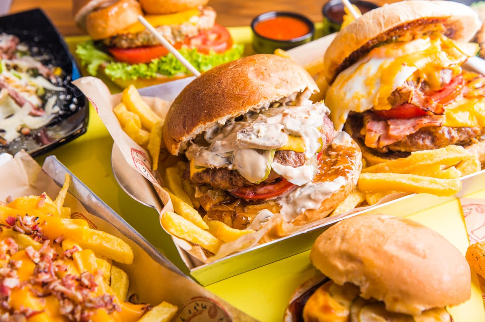

The most delicious and great burgers with the most delicious handmade juicy burger & most delicious steaks are here
and waiting for you to finish them at one of the 5 Butcher's Burger & Steak House shops!

*Information and photo retrieved from:* [Butcher's Burger](http://www.butchersburger-steak.gr)

**Feyrouz**

"Feyrouz" is a corner in the historic center of Athens overlooking Aeolos, aiming to introduce its guests to the family's small gastronomic history, originating in Antioch and Lebanon, Cyprus and Constantinople.
A corner that hopes to accommodate its guests for the scarce time they spend in the city's daily life, the warmth of the place, the hospitality of the family atmosphere, the coziness of quality music, and above all, the enjoyment of eating nobody fresh, handmade and full of family delicacies, like at home, a little deeper, somewhere in the East.

*Information retrieved from:* [Feyrouz](https://feyrouz.gr/) |
*Photo retrieved from:* [TripAdvisor](https://www.tripadvisor.com.gr/Restaurant_Review-g189400-d6784810-Reviews-Feyrouz-Athens_Attica.html)

**The Bank Job**

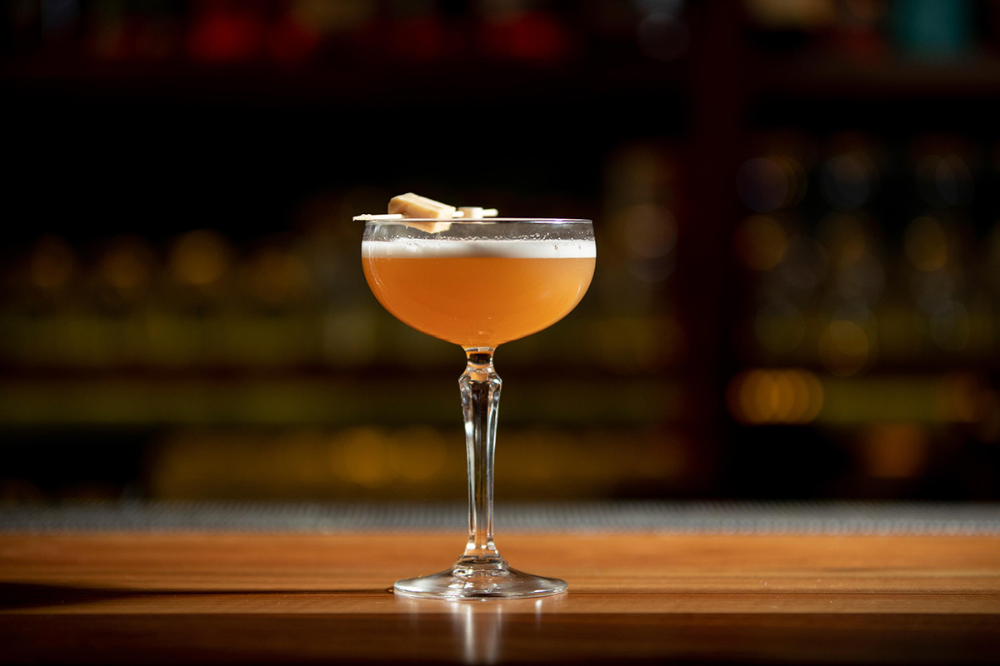

"The Bank Job" is a cocktale bar on Kolocotroni street, housed in one of the historic buildings of the athenian city center. It aims to "marry" the old and the new and "break the rules". It offers unique cocktale mixes and some of the best ,usic in the city.

*Photo retrieved from:* [The Bank Job](https://thebankjob.gr/photos.php)

**Telescope**

“Telescope” is a Cafeteria-Bar-Restaurant located in the top of a hill in Chaidari,Athens . This place has a breathtaking view and you will definitely get the best view of Athens from there . Also , this place offers a wide variety of drinks and delicious meals. Definitely worth a visit .

*Information and photo retrieved Petros Siachos*

**Riza Riza**

Riza Riza is a cozy and friendly greek restaurant at [Koukaki](#koukaki) (19 Drakou Street, Athens) and it’s a great choice for all day long.  
There you can enjoy your morning coffee and brunch and delicious food as well as special cocktails made from Greek distillates (raki, ouzo and tsipouro) later at night.  

If you’re planning on visiting, don’t forget to try the great pancakes that they serve.

*Information retrieved from:* [etable.gr](https://www.e-table.gr/restaurant/riza-riza) |
*Photo retrieved from:* [Riza Riza's facebook page](https://www.facebook.com/RizaRiza.Athens/)

**Mama Roux**

Located on Aiolou Street in the heart of historic Athens' commercial district, Mama Roux is a multi-ethnic restaurant offering dishes from many cultures in a relaxed, urban atmosphere. By using techniques derived from different cultures, this restaurant offers a wide-ranging menu, moving continuously towards new directions while also retaining its classical dishes.

*Information and photo retrieved from:* [Mama Roux](http://www.mamaroux.gr/)

**Seychelles**

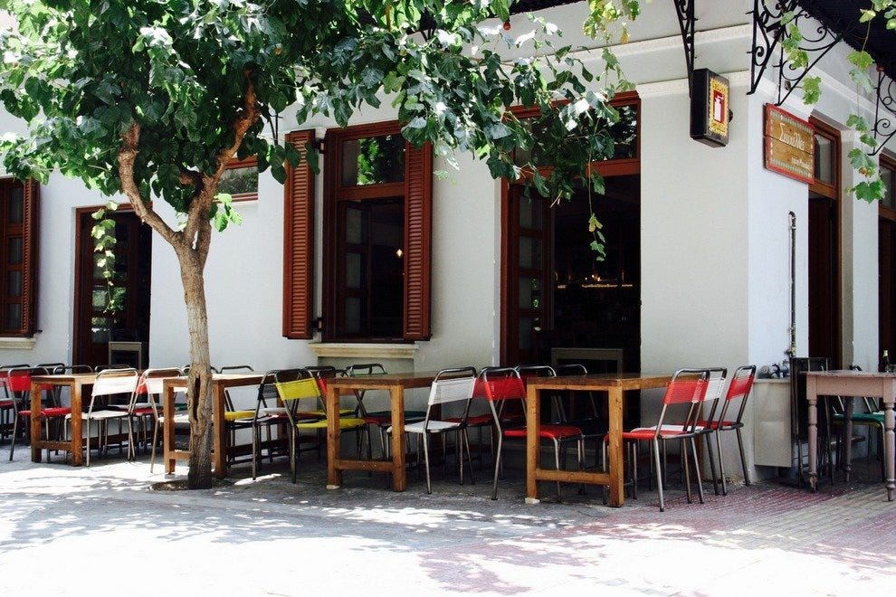

Seychelles is located on Metaxourgeio and serves value for money greek food. Reservations are suggested.

| Opening Hours: Daily 10:00 to 2:00
| Contact: +302111834789

*Information retrieved from:* [Seychelles](http://www.seycheles.gr/en)

**Cookoovaya**

Cookoovaya philosophy is based on friends sharing dishes: sampling, tasting, enjoying. The menu changes with the season, and the kitchen is continually evolving. The menu features: salads, cold dishes and raw, wooden oven, charcoal, casserole and fritters, and desserts.

*Information and photo retrieved from:* [Cookoovaya](https://cookoovaya.gr/en/)

**Koi Sushi Bar**

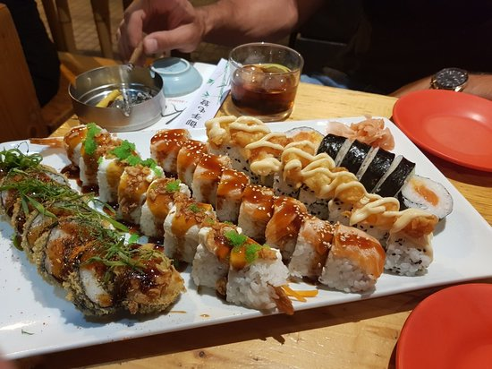

If you are a fan of sushi, you must visit it while you are staying in Athens. It is located in the city Center, really close to the Syntagma Square. The service is really nice. People are really polite and your order gets ready really quickly. One more attribute of this place is that the sushi tastes nice, there are a lot of options you can choose from and they are considerably cheap. If you have never tried sushi in your life before I suggest you do it in this place, since people are helping you to find out what you will like the most.

*Information and photo retrieved from:* [Trip Advisor](https://www.tripadvisor.com.gr/Restaurant_Review-g189400-d5121936-Reviews-Koi_Sushi_Bar-Athens_Attica.html)

**Hot Hot Burger Bar**

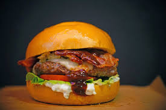

You are in downtown Athens and you want something delicious and quick at the same time? Hot Hot Burger Bar is there for you! There are a lot of burgers you can choose from and 10 different types of sauces, all made by them! Of course I haven't tasted them all, but I guarantee you that every single one of them is so tasty. Get there(it is very easily accessible) and you won't miss out. A really important note would be that there are a lot of vegan burgers, for every vegan out there wanting to eat a delicious burger.

*Information and photo retrieved from:* [Hot Hot Burger Bar](http://www.hothot.gr/)

**Etnico**

Etnico is all about ethnic street food right in the center of Athens. In this place, you can taste the world, so you can choose different plates from different countries and even different continents. Some examples would be Mexican Chimichanga και Burrito, Arabic Falafel, Indian Samosas and Korean salads. As I mentioned earlier it is located between the two metro stations, Syntagma and Monastiraki. So from wherever you choose to go, just have in ming that it is about 10 minutes on foot. Don't get intimated by that, it is a really nice place to visit and eat since the food is really tasty. Let alone that you are going to enjoy walking till there, as the Ermou street is really close to it. My personal recomendation would be, to strall around Ermou street, maybe even go shopping there and afterwards grab something to eat from Etnico.

*Information and photo retrieved from:* [Etnico](https://www.etnico.gr/)

**The Big Bad Wolf**

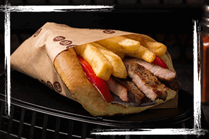

The Big Bad Wolf is a place where you can enjoy delicious and quality food. It can be a burger, a souvlaki or even a salad. You can choose whatever your preferations are, from a double bacon burger to a vegan one. So every customer will be satisfied after going to this place. The Big Bad Wolf is located in a variety of locations so if it happens you are close to one of those don't hesitate. You are going to leave the place with a sense of fulfillment, as you are going to enjoy the food. Another really import advantage of this place is that the people who work there are really polite and your order is ready really quickly.

*Information and photo retrieved from:* [The Big Bad Wolf](https://www.tbbw.gr/)

**Basegrill Athens**

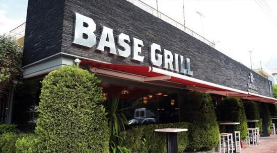

Basegrill Athens started in 2005 and it's a very famous Steak House - Restaurant, due to the high quality meat as well as the great hospitality. Meat is highly respected there, it is treated as a gift and they are constantly looking to choose the best ones from the Greek market. It is then prepared with caution and cooked at the right temperature. Finally it is served and cut right in front of the customer. Because of all of this quality, Basegrill Athens got the attention of plenty people and even a great amount of celebrities. So, what are you waiting for? Go and try a taste of warm hospitality and high quality menu.

*Address retrieved from:*[Λεωφ. Κωσταντινουπόλεως 64, Περιστέρι](https://www.google.com/maps/place/Basegrill+Athens/@38.0105273,23.7088258,16.75z/data=!4m5!3m4!1s0x14a1a36c7e066517:0xe6c56d4281732b98!8m2!3d38.0118955!4d23.7081823) |
*Photo retrieved from:*[Athens Voice](https://www.athensvoice.gr/guide/taste/restaurants/82725_base-grill)

**Bel Rey**

Bel Rey is a former car lubricant turned into an all day snack bar. With vintage furniture, glazed posters with current theatrical performances and a large wooden bar, Bel Rey is sure to become a favorite hangout for both yound and old. There is a wide range of tasty brunch and cocktails.

*Information retrieved from:* [maxmag](https://www.maxmag.gr/city-guide/athina-koukaki-bel-rey/)|
*Photo retrieved from:* [Google](https://www.google.com/search?q=%CE%BC%CF%80%CE%B5%CE%BB+%CF%81%CE%B5%CF%85+%CE%BA%CE%BF%CF%85%CE%BA%CE%B1%CE%BA%CE%B9&tbm=isch&ved=2ahUKEwix1-mJhpHoAhWIhxQKHbdmBtYQ2-cCegQIABAA&oq=%CE%BC%CF%80%CE%B5%CE%BB+%CF%81&gs_l=img.1.0.35i39j0j0i8i30j0i24l7.1329.3350..4335...1.0..4.180.1479.0j11......0....1..gws-wiz-img.....10..0i67j35i362i39j0i131.pQF0tnEByWw&ei=-iBoXrHyLoiPUrfNmbAN&bih=754&biw=1536#imgrc=G-r2KpU02Cih3M)

## Night Life

Of course, when you visit Athens, you cannot skip its night life. Below, we have listed some of the best bars for you.

**Istioploikos**

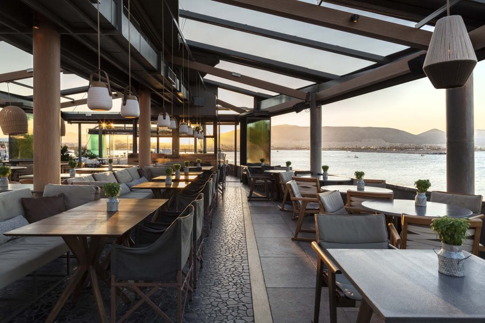

A magnificent place right along the seaside! It is placed in Piraeus and it is really nice to visit all day long. You can enjoy your coffee, drinks of even food, which is so delicious! Istioploikos although was added in the night life section, since in the night the place becomes even more better. it turns into a bar, where people drink their cocktails and listen to good music. The really known party of Istioploikos takes place every Sunday evening from 9 pm. The most easy way to go there is by car.

*All information retrieved from:* [Istioploikos](http://www.istioploikos.gr/el/)

**Terra Petra**

What a nice way to enjoy your evening whilst glazing the whole beauty of Athens. Terra Petra has a breathtaking view across Athens and it is really nice play to get your cocktail and drink. Don't missunderstand me, this place is really nice to visit all day. Of course, on the daylight you don't want to drink a cocktail, or do you? Either way, you can also enjoy there your brunch along side with a cup of coffee or fresh juice. It is placed in Petroupoli, so you can get there by bus or by car. Don't worry, there is a huge parking lot waiting for you!

*All information retrieved from:* [Terra Petra](https://www.terrapetra.gr/)

**Apolis**

Another magnificent place in Petroupoli, just like Terra Petra is Apolis. There are really close to each other and they offer pretty much the same thing. A breathtaking view while enjoying your beverage, cocktail or food. Apolis is a little bit more cozy than Terra Petra, so if you don't want loud music, this is the place for you. You can talk and chill with your friends and family there. I promise you that you are going to enjoy every second while sitting there and enjoying the view.

*Image retrieved from:* [Apolis](http://www.apolis.gr/)

**A For Athens Cocktail Bar**

A For Athens is an ideal place to enjoy your house special cocktails at night! On the top floor, there is an urban terrace which creates a beautiful and fun atmosphere with a stunning view over the Acropolis and Monastiraki Square. It is placed right in the city center and is easily accessible, as the metro station is 2 minutes away on foot.

*Information retrieved from:* [TripAdvisor](https://www.tripadvisor.com.gr/Attraction_Review-g189400-d2665318-Reviews-A_for_Athens_Cocktail_Bar-Athens_Attica.html) |
*Photo retrieved from:* [A For Athens](https://aforathens.com/photos/)

**Telescope**

It’s a marvelous quiet place up on a hill at [Chaidari, Athens](https://www.google.com/maps/place/%CE%A4%CE%97%CE%9B%CE%95%CE%A3%CE%9A%CE%9F%CE%A0%CE%99%CE%9F/@38.006967,23.6540462,17z/data=!3m1!4b1!4m5!3m4!1s0x14a1bb5282459acb:0xbcb04e251a50a81a!8m2!3d38.006967!4d23.6562349). It's like love at first sight! You most definately won't need more than a moment to fall in love with this place. Inside the store you will find 21 telescopes which you can use to look at the magnificent view from the Piraeus port to the Olympic Stadium! The ideal spot for a relaxing drink or a dinner!

*Information retrieved from:* [XPAT ATHENS]( https://www.xpatathens.com/)

**Lohan Nightclub**

If you like pop and trap music, this club is definitely a must for you. The huge space and the beautiful design will give you an unforgettable experience. In this club, you can have your favorite drinks, dance till the morning and enjoy the performance of the best DJ's in the world. It is near the city center, just a five-minute walk from the metro station "Keramikos"!

*Information and photo retrieved from:* [TripAdvisor](https://www.tripadvisor.com.gr/Attraction_Review-g189400-d11827483-Reviews-Lohan_Nightclub-Athens_Attica.html)

**Nalu**

Nalu is an all day venue, next to the sea and open all year! It is located in Alimos and you can go there by bus or tram, but I would recommend by car since the place offers a free parking lot! A cozy environment offers its customers to enjoy themselves all day long. In the morning, you can enjoy your beverage and brunch with the unique sea view. In the afternoon, you can enjoy the breathtaking sunset next to the sea while drinking a glass of wine. And in the night, you can enjoy unique cocktails and drinks, while listening to your favorite music.

*Information retrieved from:* [Nalu](https://www.nalu.gr/en/home) |
*Photo retrieved from:* [Regroup](https://www.regroup.gr/default/388/deals/5870/nalu-menu/)

**Holy Spirit Cocktail Bar-Holy Spirit Beach Bar**

If you like cocktails and fancy drinks, then Holy Spirit is an ideal place for you. It is located at Laodikis 42 street in Glyfada, about 100 meters far from Nymfon Square. Holy Spirit offers a large variety of cocktails and drinks such as sour cocktails like Gimlet, bitter cocktails like Negroni, sweet cocktails like Mai Tai and salty cocktails like Margarita.

If you prefer cocktails only in summer, then Holy Spirit Beach Bar is a very beautiful place and the best choice that you have. Enjoy amazing and tasty cocktails at the beach of Varkiza with the sound of the sea waves. Holy Spirit Beach Bar is located at Varkiza Resort Yabanaki beach.

*Information retrieved from:* [Varkiza Resort](https://www.varkizaresort.gr/el_GR/stores/holy-spirit.html) |
*Photo retrieved from:* [Varkiza Resort](https://www.varkizaresort.gr/media/upload-files/cache/843/84346924fb1b5c02c2e105b1c65ddc6a_mg5443.jpg)

**Beauty Killed the Beast**

Inspired by the last lines of the first King Kong movie in 1933 _"It was beauty. As always, beauty killed the beast"_, this fantastic *cocktail bar* offers high quality cocktails, but that's not just it. It is located inside a house that was built at the '30s and its decor is a funky mix of vintage and industrial, including an underground urban jungle, which create a chill, cinematic scene.
You can visit Beauty Killed the Beast for its amazing _cocktails_, as well as its wonderful _brunch_ that also has a lot of vegan options.

_📍 : Paramithias 14, Kerameikos_

_📞: +30 21 0524 0117_

_Photo retrieved from [Athens Voice](https://www.athensvoice.gr/)_

**Bouzoukia**

There are two types of bouzoukia, or pistes, which literally means ‘stages’. First there are the big ones. Think of them as a cross between an indoor concert and a club. You’ll find these venues around Iera Odos in the Gazi neighbourhood and Syngrou Avenue during the winter, and on Posidonos Avenue, which runs along the city’s southern coastline, in the summer. This is where the biggest stars of the Greek popular music scene, such as Sakis Rouvas, Anna Vissi, Antonis Remos, Despina Vandi, Giorgos Mazonakis, Paola, and so on, sing.

Then there are the smaller, borderline cult stages, that we call skyladika, which literally means “where the dogs hang out.” Think of these as the B-list versions of the glamourous bouzoukia, where the singers, musicians and booze are second-class, where the flowers could have been stolen from a nearby cemetery, and where many of the customers are dodgy characters of the night. But don't worry, these are still great places to spend your night and see what night life mean to Greek.

*Information retrieved from:* [This is Athens](https://www.thisisathens.org/nightlife/live-music/night-out-bouzoukia)

**The Clumsies**

Nestled in an unassuming street in the vibrant centre of Athens, The Clumsies is an all-day cocktail bar that has steadily climbed its way up the World’s Best list since its inception in 2012. Don’t let the name fool you, there is nothing clumsy about the quality of cocktails, food or service offered at this slick Athens hip-spot. The Clumsies' philosophy is not only centred around creating a unique cocktail and food experience, but also promoting interaction between the customer and bartender to encourage the exploration new tastes and flavours.

*Information retrieved from:* [Greek City Times](https://greekcitytimes.com/2017/11/23/athens-bar-clumsies-ranked-among-worlds-best/?amp) |
*Photo retrieved from:* [The Clumsies](https://www.theclumsies.gr/)

**Jazz in Jazz**

Jazz In Jazz is, well, ..a Jazz bar! But not any kind of Jazz bar. Jazz In Jazz is kind of like a small Jazz museum. There you can find a collection of 12.000 records and various rare recordings. You will spend the night listening from '20s to '60s Jazz and sometimes modern Jazz if you are lucky. Along with good old Jazz you can enjoy some good hard liquor from their huge variety. Just for reference, there are 120 makes of whisky! There might be no Wifi, but this warm and atmospheric place will still keep you pretty entertained through the night!

Useful info:

| Schedule      | Everyday: 20:00 - 03:00|
| ------------- |:----------------------:|
| Address       | [Dinokratous 4 Athens 106 75](https://www.google.com/maps/place/Jazz+In+Jazz/@37.9790924,23.7426759,15z/data=!4m5!3m4!1s0x0:0xcb743ab1d8a0c96d!8m2!3d37.9790924!4d23.7426759) |
| Contact       | (+30) 21 0722 5246 |

*Information retrieved from:* [Popaganda](https://popaganda.gr/citylife/jazz-in-jazz/), [Jazz In Jazz](https://jazzinjazz.business.site/), [Athinorama](https://www.athinorama.gr/clubbing/place.aspx?id=5001112)  
*Photo retrieved from:* [Popaganda](https://popaganda.gr/wp-content/uploads/2018/03/xIMG_8555.jpg.pagespeed.ic.pJDyb01pV5.webp)

**New Habits**

Relatively new to Nea Smyrni square, New Habits is a all day cafe-bar located. Very Popular for its cocktails and parties, new Habits is a perfect destination to have fun at one of
the most popular squares of Athens, day and night.

*Photo retrieved from:* [New Habits](http://newhabits.gr/gallery/the-place/#prettyPhoto)

**Baba Au Rum**

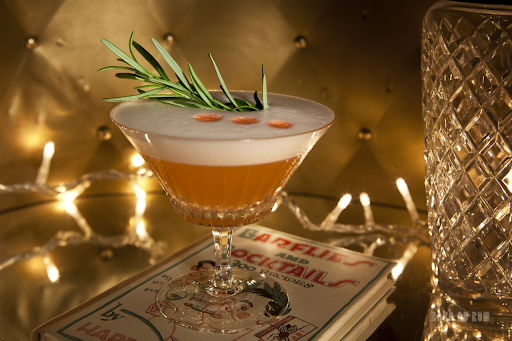

Baba Au Rum has won multiple awards over the last few years and have been listed as one of the best rum bars in the world. It has become renowned for its premium selection of rum and other spirits, while also having exotic drinks mixed with organic herbs and unexpected spices. You will find it a few twists and turns away from Syntagma Square at [Klitiou 6](https://www.google.com/maps/place/Baba+au+rum/@37.9773968,23.7276655,17z/data=!3m1!4b1!4m5!3m4!1s0x14a1bd3c8e015b15:0xde9376e3acda79ed!8m2!3d37.9773968!4d23.7298542).

*Information retrieved from:* [Why Athens](http://newhabits.gr/gallery/the-place/#prettyPhoto) |
*Photo retrieved from:* [Baba Au Rum](http://babaaurum.com/)

**Lot 51**

Lot 51 gives a lot of value to the quality of the coffee and wants to make it a better as possible. Apart from that, you can find there very interesting labels of whiskey and a lot of tasty cocktails. Last but not least, there are many choices there if you want to have a meal, for example brunch, salat, burger or even pasta.

*Information & photo retrieved from:* [Esquire](https://esquire.com.gr/poto/bars/5852/giati-oloi-pigainoun-sto-lot-51)

**MYLOS**

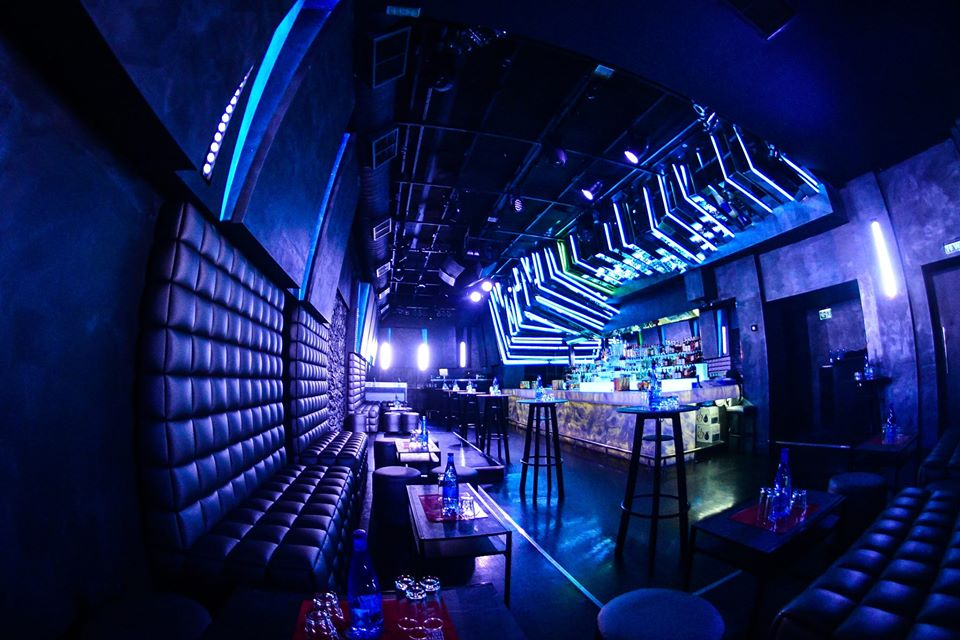

Mylos is one of the greatest club in Athens. It is really famous and respected in the west suburbs of Athens. A single night in this marvelous club will make you a great fan of it. Before you know it, you will become a regular customer. If you like trash Greek music combined with just a bit of trap and rap, Mylos is the place you need to be.

*Photo retrieved from:* [MYLOS' facebook page] https://www.facebook.com/pages/category/Dance---Night-Club/MYLOS-173618299411072/

**TYCO**

Are you interested on spending a chill night walking around Athens with your favourite cocktail at hand? Then Tyco is the best place  for you to visit.  
It is located at 11 Romvis street, 10560 Athens, Greece and offers you various tasty and cheap cocktails from the classic ones to more exotic and different.   
Grab your favourite cocktail and start exploring Athens by night.

*Information and photo retrieved from:* [TYCOS' facebook page](https://www.facebook.com/TakeYourCocktailOut/)

**Couleur Locale**

The hidden bar on Normanou Street, near the Monastiraki’s square, is one of the most beautiful terraces. From the third floor, facing the sacred rock of the Acropolis, you can enjoy both the view and the variety of food and drinks in affordable prices it provides.

When the sun sets, you'll also enjoy selected lounge and house music by well-known Greek and world DJ's!

*Information and photo retrieved from:* [αθηνόραμα bar awards](https://www.athinoramabarawards.gr/bar-vravevmeno.aspx?id=10005350&Year=2019)

**Plintirio Bar**

Wanna go back in time and dance to the goldies of the 80s, 90s and 00s? Plintirio bar takes you to a laundry room styled bar where you can drink, dance and have fun!  

*Photo retrieved from:* [Plintirio bar facebook page](https://www.facebook.com/%CE%A0%CE%BB%CF%85%CE%BD%CF%84%CE%AE%CF%81%CE%B9%CE%BF-Bar-1413208995564217/)

**Six Dogs**                                                                                                                                                                                                                                   

                                                                                                                                                                                       

Six d.o.g.s is an all day/all night cultural center in the historical triangle of Athens. It combines a Gig space, Project Space, a bar, a foyer and a garden. It does over 500+ events yearly on average and the venue keeps a hyperactive but never tiring character. It offers all kinds of homemade seasonal beverages, unique cocktails and the best edible treats you can think of. Along with that, the design when mixed with all the events makes this places irresistible.                                                                                                                                    

*Information retrieved from:* [SixDogs](http://www.sixdogs.gr) |*Photo retrieved from:* [Popaganda](https://popaganda.gr/citylife/six-d-o-g-s-presents-broken-king-cocktail/)

**Cabezon**

In one of the most beautiful yards of Metaxourgio, a little paradise is hidden. With cobblestones, small tables and some tires instead of seats, Reggae music and calmness. That kind of calmness that reminds you of your summer vacation. At Cabezon you can sit there and talk, enjoy your night, have some meze and chill with your group of friends with some beer or wine.

*Information retrieved from:* [Nou-Pou](https://www.nou-pou.gr/ektos-synorwn/pame-kentro/oi-6-pio-omorfes-ayles-sto-meta3oyrgeio/) |
*Photo retrieved from:* [Kathimerini](https://www.kathimerini.gr/829044/article/epikairothta/ellada/ayles-all-day)

**Romantso**

Romantso is the former office building of the homonymous brochure and is located in the historic shopping center of Athens. It is both an office space for creative start-ups and a cultural center, open to public, with a daily event schedule.The cultural center offers a wide range of events, related to the interests of urban life, music, performance, art, food and conversation. You can check the upcoming events at http://www.romantso.gr/

*Information retrieved from* [Romatso](http://www.romantso.gr/) |
*Photo retrieved from* [Google](https://www.google.com/search?q=%CF%81%CE%BF%CE%BC%CE%B1%CE%BD%CF%84%CF%83%CE%BF&sxsrf=ALeKk01auHXnsajePHv3ClDG0fnFGJqpjw:1583845072683&source=lnms&tbm=isch&sa=X&ved=2ahUKEwiLzr7X-o_oAhVEzqYKHaUKBZQQ_AUoAnoECA4QBA&biw=1536&bih=754#imgrc=fIDG1nB8C9bA_M)

**Drunk Sinatra**

This hidden all day bar with its vintage theme is located close to the popular night spots of Kolokotroni Street and has been a hit with the locals from the day it opened. Paying homage to old “blue eyes”, this long narrow bar sees patrons spilling out onto the pavement, where additional tables and chairs are set up and are well serviced. Its décor and cocktail list are inspired by the ‘50s and ‘60s and has a fun relaxed atmosphere. Many start the night here before moving on to the next hotspot.

*Information retrieved from:* [WhyAthens](https://whyathens.com/athens-nightlife/) |
*Photo retrieved from:* [TripAdvisor](https://www.tripadvisor.com/LocationPhotoDirectLink-g189400-d6029269-i209959965-Drunk_Sinatra-Athens_Attica.html)

**360 Cocktail Bar**

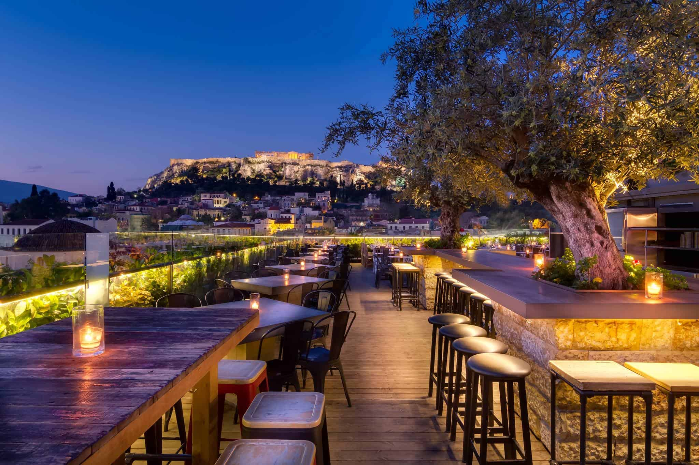

The name of this place says it all. 360 Degrees is a lush rooftop garden and cocktail bar with a unique industrial design that gives guests panoramic views of the entire city and the Acropolis. Right on Monastiraki Square, just steps away from the Monastiraki Flea Market, 360 Degrees is the place to go to for some dining and drinks with the best view of Athens, hands down!

*Information and photo retrieved from:* [Greek City Times](https://greekcitytimes.com/2018/07/03/athens-immaculate-360-degrees-rooftop-bar/?amp)

## Tours

In order to enjoy the beauty of the city, you have to walk. So here are some tours worth doing.

**Stavros Niarchos Foundation SNF**

Named after the founder of the construction the Stavros Niarchos Foundation was established in May of 2019 and so it offers some of the most modern facilities. The foundation is famous for
its enormous halls and spectacular events. Due to its advanced amenities, the national library transported all their books there and now you can enjoy a good book while being there. Setting
all these cool features apart, the foundation offers a great place for long walks and astonishing views of Saronikos. The foundation is placed on the main seaside avenue close to Faliro.

| More Info     |                        |
| ------------- |:----------------------:|
| Halls         | [More...](https://www.snfcc.org/diathesi-horon) |
| News          | [More...](https://www.snfcc.org/news) |
| Opening Hours | [More...](https://www.snfcc.org/visit-snfcc) |
| Contact       | (+30) 216 8091000 |

*Info retrieved from:* [SNF](https://www.snf.org/en/) | *Photo retrieved from:* [AthensVoice](https://www.athensvoice.gr/places/99674_kentro-politismoy-idryma-stayros-niarhos-snf)

**Monastiraki**

Photo by Adrian Dascal on Unsplash

Stroll around the picturesque Monastiraki and Plaka neighbourhoods
Feel the atmosphere of "old Athens" and get the touch of history on the pedestrian streets.
It’s hard to imagine how many different experiences can fit in two neighbourhoods of a city centre! Archaeological sites, little arrays, old beautiful houses, antique shops and pittoresque cafes live together in the neighbourhoods of old Athens.
Plaka is full of people, colours and music! With the “tavernas” (typical Greek restaurants), the little shops, the cozy cafés, you will feel like playing in a movie of the ’60s. Don't miss out!

**Kifissia**

Just 14km from downtown Athens – or a short, 35-minute ride from Monastiraki on the electric railway (HSAP), Kifissia is a great choice for an action-packed day. Enjoy glamorous shopping, admire wonderful art, dine at a restaurant and study a fascinating mix of centuries-old mansions. Here you can relish cool air, abundant greenery and a sense of nonchalant affluence that is light years away from the sometimes overwhelming chaos of the city center. While Kifissia’s boutiques may be the exclusive domain of the elite, there is an abundance of things to discover and explore beyond shopping.

*Information retrieved from:* [Kifissia](https://www.greece-is.com/kifissia-the-northern-aristocrat/)

#### **Koukaki**

This residential neighborhood, located at the foot of the Acropolis and the Filopappou Hill, is a combination of authenticity, convenience and entertainment. One of Koukaki’s highlights is the blend of architectural styles it contains. With its mismatch of neoclassical houses, low-rise buildings dating from the 1930s and post-1970s apartment blocks, Koukaki includes small shops, traditional restaurants, art galleries, museums and colorful bars and cafes. After a leisurely stroll around the streets, you can be sure to always find a café with a couple of tables and chairs set up outside where we suspect your coffee break will quickly turn into an impromptu lunch. Whether you are on your own or with friends, looking to celebrate a special occasion or simply want to hang, Koukaki has it all.

*Information and photo retrieved from:* [Culture Trip](https://theculturetrip.com/europe/greece/articles/a-walk-around-koukaki-neighbourhood-in-central-athens/)

**Thisseio**

Picture-perfect Thisseio is an ideal district for relaxing strolls and evening walks with views over century-old monuments. In addition to Filopappou Hill, the pedestrian street of Dyonisus Areopagitou and the lines of street vendors selling crafts and jewelry are just some of the highlights. Green, quiet and charming, Thisseio has also its fair share of cafés, bars and restaurants, where during the warm days, you can find a quiet corner on a terrace to enjoy a great book or an intense conversation with your friends. And just when you thought you knew everything about Thisseio, it surprises you with its small collection of museums, such as the Herakleidon Museum of Visual Arts, housed in a neoclassical mansion, or the "Stoa of Attalos Museum", located in the Ancient Agora.

*Information and photo retrieved from:* [Culture Trip](https://theculturetrip.com/europe/greece/articles/a-walking-guide-to-thisseio-neighbourhood-athens/)

**Flisvos Marina**

Around Flisvos Marina area, just a few miles away from Syntagma square, you can enjoy at the same time the seaview, high quality food and your walk along the beach. Moreover, one could immerse themselves in plenty more activities, such as riding a bicycle, jogging and walking. The historic battleship “Georgios Averof”, which operates as floating naval museum, is located right next to it. Not too far from it, Water Plaza (Plateia Nerou) is situated, in which – mainly during the summer months – festivals and concerts take place.

*Information retrieved from:* [Battleship "Georgios Averof"](http://averof.mil.gr/en/)

**Filopappou Hill**

Filopappou hill, also called the Hill of the Muses, is the perfect spot for a stroll especially at sunset! The hill offers a breathtaking view to the Saronic Gulf and of course and a really advantaging point to take a photo of the Acropolis. Of course there is a lot of history hidden in this hill. The monument of Filopappos, which identifies the hill, was built between AD 114 and 116 in honour of Julius Antiochus Filopappos, a prominent Roman consul and administrator.

*Information and photo retrieved from:* [Lonely Planet](https://www.lonelyplanet.com/greece/athens/attractions/filopappou-hill/a/poi-sig/1008076/359421)

**Pasalimani - Marina Zeas**

Looking for a place near the sea to spend your day? Pasalimani or Marina Zeas is your answer.  
Pasalimani or Marina Zeas is the second biggest port of Pireaus.  In the ancient times, it was the biggest military harbour.  Nowadays, it is said that is the center of amusement of Pireaus. There you can enjoy the beauty of the sea while walking around the port or by visiting one of the plenty of restaurants, coffee shops and shops around the port and Kanari’s square.

*Information retrieved from:* [Wikipedia](https://el.wikipedia.org/wiki/%CE%9B%CE%B9%CE%BC%CE%AD%CE%BD%CE%B1%CF%82_%CE%96%CE%AD%CE%B1%CF%82) |
*Photo retrieved from:* [Pinterest](https://gr.pinterest.com/)

**Psyri**

Psyri or Psiri is a colorful neoclassical neighborhood known for its artisans, specialty stores, restaurants, bars, tavernas with or without live music, theaters, art galleries, antique shops, and a small number of hotels. Following the liberation of Greece from the Turkish occupation in 1833, several veteran freedom fighters and immigrants from the provinces settled here. They opened cottage industries and workshops, which have given the area a distinctive character. The central square of Psyri is called "Heroes Square" because the streets leading to it carry names of heroes of the Independence War.

*Information retrieved from:* [The Athens Key](https://www.athenskey.com/psyri.html) |
*Photo retrieved from:* [Airbnb](https://www.airbnb.com/google_place_photo?photoreference=CmRaAAAAO8tx19UtVxjviOYx_M7Jc0FzyqjtLFkf56onDvfR8LkwHz67HY6N3gKHHWKLFa9Jf9Hfj1fedshOKNO97gSa-GC2p83cUZthl3Rk0GOmAzQRNUtI_AVpwo6jqKwTf8MUEhCfBHu79i9xw9FaXZ7-2gqFGhRGMpqWMT-2euuYZrCXNEmXt3hgUA&maxwidth=1200&maxheight=1200&place_id=84439)

**National Observatory**

About 18km outside the center of Athens, is the National Observatory of Athens. It is operation since 1995 and has been hosting visitors for years. The main goal of the Observatory is to spread the astrophysics knowledge we have, to the visitors, in the simplest way possible.

The location of the Observatory offers a panoramic view of Athens which is breathtaking! The visiting room can host up to 125 people and you need to book a ticket in order to join. The stuff will give you a very interesting introduction before going to the big room of the telescope where you can look at the stars and planets.

*Information and photo retrieved from:* [Like A Local](https://www.likealocalguide.com/athens/penteli-observatory)

Apart from all the tours you can do on your own, you can also join some organized walking tours in Athens. Using the app Freetour.com (Available for both Android and iOS) you can join for free tours such as:

[!()](https://www.youtube.com/watch?v=KphBnQum_4w)

**Athens Street Art Free tour**

This tour, offered in English, takes you to the Exarchia square, a neighborhood in the city center of Athens. A local artist will let you explore the varied street art and its rich history. Art will vary from political to social messages or simply pieces of pure art, some of which has been left by great graffiti artists from Europe.

**Athens free Food tour**

Enjoy the best local on-the-go snacks on your way to visiting the most popular fresh markets, in which you are going to taste a selection of traditional products.

**Walk in Beautiful and Secret Athens**

Discover the beauty of the city through a small hidden in the heart of Athens.It will make you travel in the cyclades for a few minutes,  then live the beauty of ancient Greece and discover a district very loved by the locals day and night.You will also have many tips for the continuation of your stay in the city or on some islands, this tour is not a tour on the history of Athens but on modern Athens with of course anecdotes on the history of the city.

*Note that these free guided tours are tip based, meaning that you can pay as much money you want, depending on how much you liked the tour. Walk and have fun!*

*Information and photos retrieved from:* [Freetour.com app](https://play.google.com/store/apps/details?id=com.freetour.android.mobileapp&hl=el)

**Saint George Square**

The perfect escape from the cities crazy lifestyle, car fumes and noisy streets Saint George square or "Plateia Agiou Georgiou" is the perfect representation of a greek county village. There is a cool cafe, a barbershop, a mini market, a restaurant and probably the most important part, a souvlaki place all located around the circle square. Every weekend the square is more alive than ever, with kids playing in front of the church and every cafe and restaurant is filled with people escaping from everyday life.

**Parnitha Mountain**

Parnitha  is the highest forested mountain on the peninsula of Attica located in the north of Athens. It's mostly known for its casino, Casino Mont Parnes, that is loacted at the top of the mountain and you can visit using the cable cars. If you're interested into the historical monuments of the mountain, Phili Fortress and the Monastery of Kleiston as well as the Tatoi Palace at the southeast of Parnitha are great choices.

If you want come closer to the wildlife of the mountain, you can visit one of the two [shelters](#mpafi) that are located in the mountain and take part at the various activties that it provides.

*Information retrieved from:* [Wikipedia](https://en.wikipedia.org/wiki/Parnitha)

**Aegina**

Situated just 40 minutes via Flying Dolphin (a sort of boat-insect hybrid that looks alarming but whizzes along) from the port of Piraeus, Aegina is one of the closest islands to Athens yet remains mainly un-touristy in spite of its popularity with Athenians.

*Information and photo are retrieved from:* [culture trip](https://theculturetrip.com/europe/greece/articles/aegina-island-perfect-day-trip-athens/)

## Museums

Here you will find the most visit-worthy museums in Athens.

**The Acropolis Museum**

The Acropolis Museum is consistently rated as one of the best museums in the world. Devoted to the Parthenon and its surrounding temples, it is cleverly perched above Athens like a luminous box. The large glass panes beautifully draw in the ancient and modern parts of the city, making it a must-see building and a wonderful place to visit. It wasdesigned by New York’s, Bernard Tschumi, with local Greek architect Michael Photiadis, it is focused on the findings of the archaeological site of the Acropolis of Athens and successfully deconstructs how the Parthenon sculptures once looked to the citizens of ancient Athens.

*Information retrieved from:* [Why Athens](https://whyathens.com/the-acropolis-museum/) |
*Photo retrieved from:* [Santorini Dave](https://santorinidave.com/best-things-to-do-athens)

**Hellenic Motor Museum**

Hellenic Motor Museum occupies 5.000 sqm. in a unique building in terms of architecture and design. Its exhibitions are dedicated to the evolution of the car and display more than 110 cars from the 19th and the 20th century.
It is located in the heart of Athens, just a few minutes away from the National Archaeological Museum.

OPENING HOURS

* Monday to Friday	10:00 – 14:00
* Saturday	11:00 – 18:00
* Sunday	11:00 – 18:00

*Information retrieved from:* [Hellenic Motor Museum](https://www.hellenicmotormuseum.gr/en/) |
*Photo retrieved from:* [the fashionable traveler](http://thefashionabletraveller.blogspot.com/2012/12/i-drove-all-day-night.html)

**National Museum of Contemporary Arts (EMST)**

The National Museum of Contemporary Art, Athens (EMST) began its operation in 2000. It is located where the former Fix Brewery premises were, on Syngrou Ave. and the building occupies a total of 18.142 sqm. on a 3.123 sqm surface.

The Museum’s has a constantly growing collection, which consists of works by Greek and international artists, such as Jannis Kounellis, Stephen Antonakos, Gary Hill, Vlassis Caniaris, Chryssa, Mona Hatoun, Emily Jacir, Ilya and Emilia Kabakov, Kim Sooja, Nikos Kessanlis, Shirin Neshat, Lucas Samaras, Costas Tsoclis, Bill Viola, Joseph Kosuth, Pedro Cabrita Reiss, Costas Varotsos, George Lappas, Oliver Ressler, Gulsun Karamustafa a.o.

From 2003 until 2008 it presented exhibitions and events at the Athens Concert Hall, the Athens School of Fine Arts and in the public space. From September 30th, 2008, it was hosted in sections of the building of the Athens Conservatoire.

In May 2015 EMST moved to its permanent premises. From October 2016 to this day, it makes use of the building’s contemporary exhibition spaces, educational facilities, screening room, the museum shop and other facilities, producing or supporting a large number of exhibitions and other activities including conferences, talks, book presentations, film screenings, and dance and musical performances and connecting people from all over the world throught culture and art.

OPENING HOURS

* Monday	CLOSED  
* Tuesday	11.00 am – 7.00 pm  
* Wednesday	11.00 am – 7.00 pm  
* Thursday	11.00 am – 10.00 pm  
* Friday	11.00 am – 7.00 pm  
* Saturday	11.00 am – 7.00 pm  
* Sunday	11.00 am – 7.00 pm  

*Information retrieved from:* [EMST](https://www.emst.gr/en/museum)  |
*Photo retrieved form:* [EMST](https://www.emst.gr/en/)

[MORE INFORMATION](https://www.emst.gr/en/contact)

**National Archaeological Museum**

The National Archaeological Museum of Athens, built between 1866 and 1889, was initially named the Central Museum. It was first established to display the numerous findings dating from the beginning of Prehistory to Late Antiquity excavated in Athens and its surroundings. In later years, it housed objects from all over the country. During World War II, the imposing neoclassical building was closed, and its pieces were placed in wooden boxes and buried to avoid the German troops from looting them. Once the war was over, the museum was reopened in 1945.

The collection is displayed along the museum’s two floors and is divided into various exhibitions, including the Prehistory Collection, the Sculpture Collection, the Vase and Minor Objects Collection and the Metallurgy Collection. It also houses a varied art collection from Ancient Egypt.

*Information retrieved from:* [civitatis](https://www.introducingathens.com/national-archaeological-museum) |
*Photo retrieved from:* [GTP](https://www.gtp.gr/TDirectoryDetails.asp?ID=4360)

**Byzantine and Christian Museum**

The Byzantine and Christian Museum, which is based in Athens, is one of Greece’s national museums. Its areas of competency are centred on – but not limited to – religious artefacts of the Early Christian, Byzantine, Medieval, post-Byzantine and later periods which it exhibits, but also acquires, receives, preserves, conserves, records, documents, researches, studies, publishes and raises awareness of.

The museum has over 25,000 artefacts in its possession. The artefacts date from between the 3rd and 20th century AD, and their provenance encompasses the entire Greek world, as well as regions in which Hellenism flourished. The size and range of the collections and value of the exhibits makes the Museum a veritable treasury of Byzantine and post-Byzantine art and culture.

*Address:*[Λεωφ. Βασιλίσσης Σοφίας 22, Αθήνα 106 75](https://www.google.com/maps/place/%CE%92%CF%85%CE%B6%CE%B1%CE%BD%CF%84%CE%B9%CE%BD%CF%8C+%CE%BA%CE%B1%CE%B9+%CE%A7%CF%81%CE%B9%CF%83%CF%84%CE%B9%CE%B1%CE%BD%CE%B9%CE%BA%CF%8C+%CE%9C%CE%BF%CF%85%CF%83%CE%B5%CE%AF%CE%BF/@37.9754096,23.7423982,17z/data=!3m1!4b1!4m5!3m4!1s0x14a1bd4139122d11:0xcfd5b8307a32933c!8m2!3d37.9754096!4d23.7445869?hl=el) |
*Information retrieved from:* [Byzantinemuseum](https://www.byzantinemuseum.gr/en/museum/) |
*Photo retrieved from:* [GTP](https://www.gtp.gr/TDirectoryDetails.asp?ID=4349)

**Benaki Museum**

Benaki's museum is one of the top museum in Athens.What you will see inside of the museum is a presentation of Greek Culture of history in art of the Greek world from the prehistory to the 20th century ,up to 6.000 object.Apart from Greek Culture what will you see is also  culture from Asians world and in the end you will be seeing ancient sculptures from Byzantium

*Information retrieved from:*[Tripadvisor](https://tripadvisor.com.gr) |
*Photo retrived from:*[Liberal](https://liberal.gr)

## Monuments

Athens is famous for its history and its numerous monuments and museums, you don't want to miss that part.

**Acropolis**

>The most famous historical monument in Greece

The Acropolis of Athens is the most famous historical monument in Greece. It was constructed in the mid 5th century BC, also known as the Golden Century of Athens. Although the most famous building on the Acropolis is the Parthenon, there are many other buildings, like the Propylaea, the Erechtheion and the Temple of Athena Nike. The Acropolis was entirely made of the finest Pentelic marble and by the best craftsmen of the era. Along the centuries that followed, it was largely destroyed by wars. The greatest destructions were in 1687 by a Venetian gun, and in 1816 when Lord Elgin removed many parts of the Parthenon frieze.

*Information and photo retrieved from:* [Greeka](https://www.greeka.com/greece-history/monuments/)

**Parthenon**

This magnificent temple on the Acropolis of Athens was built between 447 and 432 BCE in the Age of Pericles, and was dedicated to goddess Athena, the city's patron. It was designed by architects Iktinos and Kallikrates, while the sculptor Pheidias supervised the entire building process and conceived the temple's sculptural decoration and [chryselephantine statue of Athena](https://en.wikipedia.org/wiki/Athena_Parthenos). The temple is considered to be the epitome of Classical Greece.

*Information retrieved from:* [VisitGreece](http://www.visitgreece.gr/en/culture/monuments/parthenon) |
*Photo retrieved from:* [Wikipedia](https://en.wikipedia.org/wiki/Parthenon)

**Erechtheion**

The Erechtheion is an ancient Greek temple located on the north side of the Acropolis. The temple was erected in 421-406 BC and was dedicated to both Athena and Poseidon. In particular, the eastern part of the building was dedicated to Athena Polias, while the western part served the cult of Poseidon-Erechtheus and held the altars of Hephaestus and Voutos, brother of Erechtheus.

On the north side of the temple, there is the famous "Porch of the Maidens", with six sculpted female figures (Caryatids) serving as supporting columns. The birthplace of the six Caryatids is the Peloponnesian village of Karyes. Five of them are in the Acropolis Museum and the last one in the British Museum; those on the building are casts.

*Information retrieved from:* [VisitGreece](http://www.visitgreece.gr/en/culture/monuments/erechtheion) |
*Photo retrieved from:* [Wikipedia](https://en.wikipedia.org/wiki/Erechtheion)

**Temple of Poseidon**

One of the most stunning views all over Greece as well as a monument difficult to forget. Located at the southernmost tip of Attica the Temple of Poseidon is build to impress and educate us about history. Stories around this temple involve King Menelaus who stopped there on his way back from Troy and King Aegeus who had the unfortunate fate of drowning on that spot, thus giving his name to the Aegean Sea.

Organizing a trip to the Temple of Poseidon is worth your time but making the most of your trip is also important by swimming on the beach, underneath the monument, getting an astonishing experience of clear blue waters.

*Information retrieved from:* [VisitGreece](http://www.visitgreece.gr/en/culture/archaeological_sites/the_archaeological_site_of_sounio) |
*Photo retrieved from:* [GreekTravelPages](https://www.gtp.gr/TDirectoryDetails.asp?ID=14990)

**Panathenaic Stadium**

The Panathenaic Stadium, or Kallimarmaro is another famous attraction in Athens. It’s located in front of Zappeion Park’s Southern entrance. It was built around 330 BC and it was where ancient Athens’ Panathenaic Games were celebrated. After being left abandoned for centuries, it was refurbished in late 19th century using Penteli marble, the same as the one used on the Acropolis. The name Kallimarmaro literally translates to “beautiful marble”, which is aptly named as it is famous for being the world’s only stadium made entirely out of marble. Its rich history is directly connected to the Modern Olympic Games as from their revival in 1896 until the Athens Olympic Games in 2004. It is also the place from where the Olympic flame sets up its journey to the cities of the Olympic Games, both Winter, Summer and Youth. From its highest tiers you can see the Acropolis and the National Garden.

*Information retrieved from:* [PANATHENAICSTADIUM](http://www.panathenaicstadium.gr/Default.aspx?tabid=84&language=en-US) |
*Photo retrieved from:* [shutterstock](https://www.shutterstock.com/image-photo/panathenaic-stadium-known-kallimarmaro-multi-purpose-713885446)

**Changing of the Guard at Syntagma Square**

For many tourists, watching the Changing of the Guard at Syntagma Square is an exciting and memorable experience. The Soldiers of the Presidential Guard stand in front of the Hellenic Parliament on Syntagma Square 24 hours a day, year-round. The guards wear traditional costumes complete with pleated skirts, leg tassels, and pompom shoes.

The Changing of the Guards takes place in front of the Tomb of the Unknown Soldier monument at 11am daily. This monument honors anonymous soldiers who died fighting for the country. The monument features a marble relief that imitates a warrior grave stele of ancient times.

*Information retrieved from:* [Planetware](https://www.planetware.com) |
*Photo retrieved from:* [Planetware](https://www.planetware.com/photos-large/GR/greece-athens-changing-of-the-guard.jpg)

## Activities

Athens has many things to do for athletics individuals too! From walking to our famous mountains to skydiving!

**Kartland**

One of the most exciting things that you can to do in Athens is Kart, the small cars like you drive at F1!! It is the 1st track in Greece to implement a self-timer system and light board in every kart! Please note that all drivers are required to wear a helmet and a disposable cap through the helmet for hygiene reasons. Kartland is located in Pallini, Athens and is easily accessible by car or by public transportations, using the metro and the bus.

*Information retrieved from:* [Kartland](https://kartland.gr/)

**Hiking**

Going hiking is a great way to explore and get to know Athens! There are a lot of places ideal for a hiking adventure!

Sounion National Park

Sounion is most known for Poseidon's mighty temple and its magnificent sunsets. Lying about 50km south-east of Athens, the  Sounion National Park hosts relics of ancient silver, lead and zinc mines, as well as cave fossils unique to the whole of Greece. Inside the park you will find a magnificent and easy trail which starts near the Agios Konstantinos village(you will usually find a parking spot there), it surrounds the dramatic Chaos gulch (a collapsed ancient cave), it continues briefly on tarmac and then the view opens and you can see the city of Lavrion as well as the islands of Makronisos and Kea. The path arrives at the church of Agia Triada, where you will find natural spring water. From there, a dirty old road will lead you to the ancient mines' washing plants and tanks and then you will come across Kitsios cave. Finally, north of Poseidon's temple you will fing the rocky outcrops of Mavro Lithari and Vasilopoula.

*Information retrieved from:*[AthensInsider](https://athensinsider.com/3-top-hikes-around-athens/) |
*Photo of Sounion National Park retrieved from:* [AthensInsider](https://athensinsider.com/3-top-hikes-around-athens/)

Ymittos Mountain

It has great view and if you climb up, you will be able to see the port of Piraeus on the one side and the Athens airport on the other side Mount Ymittos in Athens, Attica, is covered with beautiful pine forest, impressive caves, historic monasteries and many marked footpaths and is very close to the center of Athens. It is also a great birdwatching area and attracts an impressive number of bird species.

If interested in finding specific trails in the mountain [Click here!](https://www.wikiloc.com/trails/hiking/greece/attica/ymittos)

*Information retrieved from:* [Protothema](http://en.protothema.gr/hiking-in-ymittos/)

**Marathon Lake**

Wanna spend a peaceful day out of the center? Marathon is the perfect place to visit! Almost 25km out of Athens , and easily being transpoted with the bus,you will get your time of your life in these calming watters of Marathon. Make sure you visit also Marathon Tomb , where the great battle of Marathon happened!

*Photo retrieved from:* [trekearth.com](https://www.trekearth.com/) |
*Information retrieved from:* [Tripadvisor](https://www.tripadvisor.com.gr/)

**Lycabettus hill**

Lycabettus hill is the highest point in the center of Athens. At the top of the hill, you can dine in the restaurant and visit the church of Agios Georgios. There are 3 ways to reach the top:

1. Climbing up the hill on foot, which is a long climb but not so difficult one.
2. Cable car if hiking and climbing isn't your thing. I would recommend that you take the cable car to get to the top and then go down on foot.
3. Car by following Lycabettus ring road, you will reach the end of the road with a huge parking lot and lot of people hanging out there. Next to the parking lot is the open theater of Lycabettus, where concerts and theatrical performances take place during summer.

No matter what you choose, you must be sure for one thing. You will enjoy the breathtaking panoramic view of Athens.

*Information retrieved from:* [Lycabettus](https://www.lycabettushill.com/) |
*Photo retrieved from:*[Tripsavvy](https://www.tripsavvy.com)

**Skydive Athens**

Are you a extreme person? Then Skydive Athens is the perfect place to fall from 14.000 ft ,but fear not because you will be receiving plenty of informations from the instructors! Is it by far the most memorable thing to do! There are also other options to do such as jumping from 8.000 ft. And at last,what Skydive athens offers is a package to teach you to make your own skydive without any instructors attached to you! To get there you will have to take a bus from KTEL Liosion to Kastro Viotias,but everything will be set,because a special bus will pick you immediatly after your arrival

*Information and photo retrieved from:* [Skydive Athens](https://skydive-athens.gr)

**Paintball Park Malakasa**

If you are in Athens and you are searching for an alternative way of fun, this is the best place for you! Paintball Park Malakasa is an area of 150 acres and it constitutes the biggest Paintball Park of Greece and one of the biggest if not the biggest in Europe. There are two independent areas, Paintball NEST, for friends and teams, and Paintball Park EVENT, for kid's parties and events. Both areas promise to offer moments of action, decompression and joy to any type of groups. The park is ready to serve every paintball scenario needed in order to fulfill its customers to the fullest! You will find formed forest fields, with army jeep, bulwarks, bridges, wooden homes, small rivers, fortresses, minefields, sniper position, observatories, stone village etc. It is only 25 minutes far from Athens and you can access the area by car, bus or train. More details on how to get there in the link below!

*Information and photo retrieved from:* [Paintball Park](https://www.paintball-park.gr/)

**Adventure Park**

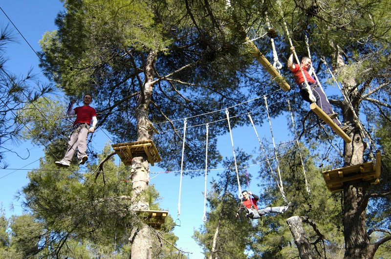

Adventure Park is a recreational area in the forest with multiple activities for you to do in nature. Some of the activities are: zip lines, archery, bungee trampoline, operation tarantula and free games. Here, you have the opportunity to "fly" from tree to tree, no matter your age, always in the safety equipment that the park will provide you. The park is located in Malakasa. Embrace your inner child and start flying!

*Information and photo retrieved from:* [Adventure Park](https://www.adventure-park.gr/index.php/en/)

**The National Garden and Zappeion**

Nothing is better than a wonderful walk through National Garden and Zappeion near Syntagma! The National Garden of Athens is a large green-space of over 160.000 square meters adorned with over 500 types of plants and trees from all over the world.The park is a picturesque green lung filled with flowers, shrubs, ancient trees and green meadows where to relax during the warm summer days. The National Garden’s most famous sights include a small pond, which is home to numerous water birds, a botanical garden, the remains of historical monuments and even a small zoo.
Easily access due to the location which is near the Syntagma Metro station and behind the Greek Parliament!
Address: Leoforos Amalias 1, Athens 10557 Greece

*Information retrieved from: *[IntroducingAthens](https://www.introducingathens.com/) |
*Photo retrieved from:*[AthensTransport](https://www.athenstransport.com/)

**Allou Fun Park**

Allou Fun Park is the most famous entertainment park in Athens. There you can experience plenty of action activities that will boost your adrenaline and make you have the time of your life. Allou Fun Park covers a wide range of ages where kids and adults can go and try a large variety of action and horror games such us star flyer, sock tower and the famous house of fear. Allou Fun Park is located at Petrou Ralli avenue at Rentis region.

*Information retrieved from:* [Allou Fun Park](https://www.allou.gr/) |
*Photo retrieved from:* [Allou Fun Park](https://www.infokids.gr/wp-content/uploads/2015/07/670754.jpg)

**Attica Zoological Park**

Attica Zoo Park is open the whole year from 9 am until sunset. With around 400 different varieties of animals, it also offers a great variety and there is something for everyone to see whichever animal they like. Do you want to check out the animals before? Then just have a look [here](https://www.atticapark.com/en/animals). Before each visit it is recommended to check [here](https://www.atticapark.com/en/visitus/opening-hours-activities.297.html) the current feeding schedule, as it changes depending on the season and day of the week. But getting hungry yourself? The zoo also offers a small café where you can sit down and enjoy a drink or snack.

| Ticket price    |       |
| --------------- |:-----:|
| Adults          |  18€  |
| Children (3-12y)|  14€  |
| Children (<3y)  |   0€  |

Additionally there are also some discounts. For more information click [here](https://www.atticapark.com/en/visitus/tickets.273.html).

Address: At Yalou Spata, Αθήνα 190 04 - Otherwise the zoo can also be reached by bus line 319 from Doukissis Plakentias and it shuttles every 35 minutes.

*Information and photo retrieved from:* [Attica Zoological Park](https://www.atticapark.com/)

**Sounio**

Cape Sounion is best known as the site of the ruins of the ancient Greek temple of Poseidon, the god of the sea. The remains are perched on the headland, surrounded on three sides by the sea. The site is a popular day-excursion for tourists from Athens, with sunset over the Aegean Sea, as viewed from the ruins, a sought-after spectacle.

*Photo retrieved from:* [VisitGreece](http://www.visitgreece.gr/deployedFiles/StaticFiles/Photos/Generic%20Contents/Arxaiologikoi_xwroi/sounion_450.jpg)

**Scuba Diving in the Blue Hole**

If you want a change from the historic attractions of Athens, an adventurous trip to the Blue Hole cave might be the thing for you!
Located south of Athens, the Blue Hole is a sea cave that burrows vertically down 30m (98ft) into the ocean floor. It resembles a man-made well and at the very bottom there is another dark opening: the beginnings of an uncharted and unexplored network of caves thought to be connected to the nearby Lake Vouliagmeni on the mainland. Your diving trip is recorded by the diving instructors, and the recording is available to take home, free of charge.

*Information and photo retrieved from:* [culture trip](https://theculturetrip.com/europe/greece/articles/the-best-day-trips-from-athens/)

#### **Mpafi shelter**

Mpafi shelter, located at Mount Parnitha, is just an hour away from Athens.
It gives you the chance to spend your day and your night at the highest part of the city and enjoy the great view and the hospitality that it provides.
You can take part at various activities like [hiking](https://trekking.gr/product/pezoporia-stin-parnitha/) during the day and
the [night](http://www.trekking.gr/el/%CE%B5%CE%BA%CE%B4%CF%81%CE%BF%CE%BC%CE%AD%CF%82-%CF%83%CF%84%CE%B7%CE%BD-%CE%B5%CE%BB%CE%BB%CE%AC%CE%B4%CE%B1/%CF%80%CE%B5%CF%81%CE%B9%CE%BF%CF%87%CE%AD%CF%82/%CF%80%CE%AC%CF%81%CE%BD%CE%B7%CE%B8%CE%B1/%CE%B2%CF%81%CE%B1%CE%B4%CE%B9%CE%BD%CE%AE-%CF%80%CE%B5%CE%B6%CE%BF%CF%80%CE%BF%CF%81%CE%AF%CE%B1-%CF%83%CF%84%CE%B7%CE%BD-%CF%80%CE%AC%CF%81%CE%BD%CE%B7%CE%B8%CE%B1)
 as well as bike riding at [Parnitha](https://trekking.gr/product/podilasia-stin-parnitha/) and [Tatoi](https://trekking.gr/product/podilasia-sto-tatoi/).

*Information and photo retrieved from:* [Mpafi shelter's site](https://www.mpafi.gr/)

**Rocks of Acropolis**

The rocks of Acropolis, otherwise called "Vrahakia" are a really popular spot for millions of tourists that the capital of Greece welcomes on a yearly basis. Everybody takes the chance to take a photo of the city view, feauting numerous buildings and also the Acropolis on the other side, or to even take a photo of themselves with the scenery. Also, this area is well known for dates and couples in general, who prefer to hang out in a quieter place than the hectic coffee shops of the center. Everyone, including families and children love to observe the view there along with a can of beer and afterwards enjoy a budget-friendly stroll around the city.

*Information retrieved from:* [SimplyLife](https://simplylife.gr/pages/protaseis/article/id/201) |
*Photo retrieved from:* [Tumblr](https://www.tumblr.com/privacy/consent?redirect=https%3A%2F%2Fwww.tumblr.com%2Ftagged%2F%25CE%25B1%25CE%25BA%25CF%2581%25CE%25BF%25CF%2580%25CE%25BF%25CE%25BB%25CE%25B7%25CF%2582)

**Sprint & Standard**
*Biathlon*

Sprint route: 5km running- 20km cycling- 2.5km running

Standard route: 10km running- 40km cycling- 5km running

Super Sprint for children

*Location:*[Olympic Rowing Schinias](https://goo.gl/maps/u9u1oMHeKrxLH7iZ6) |
*Information and photo are retrieved from:* [Art&Life](https://www.artandlife.gr/athens/events/diathlo_sprint_standard)

**Kyma Surf School**

Kyma surf school based in Athens is a mobile surf school and open all year round for all ages.From the beginner who looking for a fun and an easy way to experience surfing to the intermediate surfer to improve their technique and ability, the friendly KYMA surf school are ready to help.Let us show you that surfing is all about fun. We teach you in small, easy waves, over a sandy bottom with proper equipment, and guaranteed smiles.

*Information retrieved from:* [kymasurfschool](https://www.kymasurfschool.gr/surf-lessons)|
*Photo retrieved from:* [Google](https://www.google.com/search?q=kyma+surf&sxsrf=ALeKk01RSKCGxl7Obv2Oj2Osr21biXZdgw:1583882709952&source=lnms&tbm=isch&sa=X&ved=2ahUKEwirmKvyhpHoAhWdxcQBHa7qAZ8Q_AUoAnoECAsQBA&cshid=1583882727586378&biw=1536&bih=754#imgrc=FDZnjouuuRNABM)

## Shopping

There are a lot of places where you can go shopping in Athens! Below you can find the most famous places!

**The Mall Athens**

Of course, if you want to go shopping in Athens you can't miss the largest shopping mall in the city! This mall brings together over 200 different shopping, entertainment and dining options. In its 4 floors you can find many famous brands, restaurants, cafés, cinemas and entertainment spaces for the whole family. It is easily accessible, since you can go there by car with a huge parking lot or public transportations using the train at the Stop Neratziotissa you just climb up the stairs.

*Information retrieved from:* [MallAthens](https://themallathens.gr)

**Ermou street**

Ermou street is 1,5 km long road in the center of Athens, connecting Kerameikos with Syntagma Square through Monastiraki. The east side of the street is a pedestrian road and a very busy shopping street. Walking down Ermou street you cannot only shop from famous brands that are located there but you can also find a lot of places to rest, such as restaurants and cafés. Since it is located in the city center it is easily accessible through public transportations(bus, metro, train). You can also visit Ermou street before or after sightseeing in the city center, like Acropolis or Parthenon, and you can dine in the Monastiraki or Syntagma Square, that are really close to the street.

*Information retrieved from:* [Wikipedia](https://en.wikipedia.org/wiki/Ermou_Street_(Athens)) |
*Photo retrieved from:* [GTP](https://news.gtp.gr)

**Golden Hall**

Right on Kifissias Avenue (Maroussi),Golden Hall is an extraordinarily beautiful building of three tiers which houses more than 140 fashion stores, making it perfect for anyone looking for a shopping experience. What makes it unique is that at Golden Hall, one can find the most expensive brands (Ralph Lauren, Carolina Herrera etc.) and visit fast fashion stores (Zara, American Eagle etc.) at the same place. Aside from the fashion stores, you will come across various cafeterias and restaurants that can satisfy all tastes, such as Wagamama, Ben & Jerry's, TGI Friday's and many more. There is also a huge underground car park with more than 1500 spaces, so you won't have to wonder around looking for a parking spot. However you can also get there using public transportation.

*Information retrieved from:* [Golden Hall](https://goldenhall.gr) |
*Photo retrieved from:* [Google](https://www.fortunegreece.com/wp-content/uploads/2018/10/03/golden-hall.jpg)

**Athens Metro Mall**

Athens Metro Mall is one of the most popular shopping mall in Athens. With more than 90 fashion stores, Athens Metro Mall becomes an ideal place for anyone who is seeking an amazing and unique experience of shopping therapy. In Athens Metro you will come across a large variety of cafeterias and restaurants where you can go and enjoy your coffee and your meal after a long and an exhausting day of shopping therapy. If you are a movie lover, then on the 3rd flor of Athens Metro Mall you will find Village Cinemas where you can go and watch the latest releases of Hollywood movies and many more. Athens Metro Mall is located near the subway station of Agios Dimitrios in Athens.

*Information retrieved form:* [Athens Metro Mall](https://www.athensmetromall.gr/) |
*Photo retrieved form:* [Athens Metro Mall](https://www.athensmetromall.gr/photos/c_574px_558px/pages/201911/athensmetromall_stores.jpg)

**Antiques in Monastiraki**

Are you a lover of old things and want to get the best antiques at the best prices? In Abysinia Square (in Monastiraki) you will find everything from beautiful expensive 19th Century furniture to totally worthless 20th century junk all displayed in a wonderfully disorganized fashion.

Tip! Try to go on Sunday when gypsies and villagers pour into town with piles of stuff they have found from all over Greece. It's the best place for stamp collectors, coin collectors, card collectors or anyone who loves antiques!

*Information and photo retrieved from:* [Athensguide](https://www.athensguide.com/shopping/)

**Voukourestiou Street**

Voukourestiou Street is the most high-end street of Athens. You can find luxury brands such as Louis Vuitton, Prada, Dior, Chanel, Rolex, and buy the perfect gift for yourself! Enjoy the atmosphere and look for the latest diamonds launched by the leaders of the fashion industry.

*Information retrieved from:* [Think Athens](https://www.thinkathens.com/blog/top-places-shopping-in-athens/) |
*Photo retrieved from:* [Athens Voice](https://www.athensvoice.gr/life/urban-culture/athens/437284_odos-voykoyrestioy)

**McArthur Glen**

With more than 100 shops, cafes and restaurants, McArthurGlen Discount Village is the first and leading discount village in Greece, with favorite designer brands renewing your style and mood, up to 70% cheaper. Discover our services and enjoy a great day in the discount village.

*Information retrieved from:* [McArthurGlen](https://www.mcarthurglen.com/el/outlets/gr/designer-outlet-athens/%CE%A0%CE%BB%CE%B7%CF%81%CE%BF%CF%86%CE%BF%CF%81%CE%AF%CE%B5%CF%82/) |
*Photo retrieved from:* [Naftemporiki](https://m.naftemporiki.gr/story/1551583/mcarthur-glen-kai-smart-park-anoixta-tis-kuriakes)

## Fun and Games

While you are in Athens you can have fun and enjoy your time there, doing a lot of different things.

**Great Escape Rooms**

If you don't know already what escape rooms are about, I can personally guarantee you that you are going to have a lot of fun while you are "locked" inside a theme room(approximately 1 to 2 hours). Great Escape Rooms is the biggest real life escape room game in Athens. The whole idea behind these rooms is that teams consisting of 2-8 people focus on completing a certain task within the given timeframe by overcoming obstacles and solving puzzles. In some challenges there is an actor or many actors inside this room with you, helping you out or the exact opposite. Of course, some of these challenges are scaring, but if you are too afraid to get locked inside a "haunted" room, don't worry there are also rooms that are not scaring at all. These rooms will expand your imagination and exercise your perceptual skills as well. Thus, you will not activate only your mind but all of your 5 senses. In extreme cases, you may need to be athletic in order to enter a certain type of room. Great Escape Rooms are located in Psirri, really close to the Monastiraki square, so it is very easily accessible through by the metro or by train.

*Information retrieved from:* [Trip Advisor](https://www.tripadvisor.com/) |
*Photo retrieved form:* [Great Escape Rooms](https://greatescape.gr/)

**Ice Skating in Megaron**

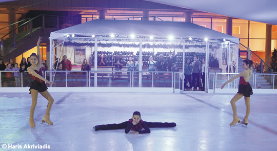

If it happens to visit Athens in the winter, Ice Skating is one thing you must do! I know that in Athens is not snowing and is mostly known for the sun and the good weather, but it would be really fun for you to go there. Even if you haven't tried it before, don't worry there are people there willing to help you learn the basics and have the best time ever. At first, it will be difficult but once you understand how you can move and become better at this, you will not want to leave the place! And you can actually do that, since you pay 10 euros for unlimited time, so you can move around the ice skating area until you are too tired. It is a really fun place, you will laugh a lot and spend a great time with your friends and family. And remember if they hesitate show them this article!

*All information retrieved from:* [Megaron](http://www.megaron.gr/default.asp?pid=255&la=1)

**The VR Project**

Virtual Reality is a simulated experience that can be similar to the real world. It can be applied for entertaining or educational purposes. While you are on a trip you want to have fun so let's focus on the entertainment part. The VR Project is the first virtual reality center in Greece. It is placed in the city center, and specifically at Monastiraki. The VR Project is available with individual or multiplayer adventures. The suggested duration for this experience is 1 to 2 hours and we guarantee you that this is the best place to get a first try or re-discover the potential of this new technology. You can choose from different categories what you want to do, for example you can visit a place really far from here if you are a fan of travelling. From a personal experience, if you are fan of video games that is the best place for you. You will discover a whole different perspective of your favourite video games. My suggestion for you is to pick a scary video game: your heartbeat is going to raise, your palms are going to get sweaty and get frightened by the plot of the video game that you have chosen, since the experience is too real and you will think that you are a part of this video game. But even if you don't want that, whatever video game you choose it is a experience worth living!

*Information and photo retrieved from:* [The VR Project](https://www.thevrproject.gr/?gclid=Cj0KCQjw0pfzBRCOARIsANi0g0v9Du_FN4pIrL9LjcYjPe5c3d6U0dOP2X5d8mCpEL9E4IXA0Yq7ar4aAtSgEALw_wcB)

**Museum of Illusions**

Museum of Illusions is the perfect place for fun and new experiences for friends and family. Illusion have delighted all generations, from children to parents and grandparents, so the whole family can enjoy their time there. The museum brings you a space suitable both for social and entertaining tours into the world of illusions. Museum of Illusion is placed in the city center, really close to the Monastiraki metro and train station so it is very easily accessible using the public transportations. If you walk by it or you have a free time while you are walking in the center of Athens and enjoying the  sun please make sure you visit this place.

*Information retrieved from:* [Trip Advisor](https://www.tripadvisor.com/) |
*Photo retrieved from:* [Google](https://www.google.com/search?q=museum+of+illusions+athens&sxsrf=ALeKk03DIqVhxtw5mY9rMvJWw1egHSFsqg:1583864088930&source=lnms&tbm=isch&sa=X&ved=2ahUKEwi7lJLDwZDoAhVQZMAKHX8QDWgQ_AUoAXoECBMQAw&biw=1366&bih=657#imgrc=phxpkZwffnIs4M)

**Cine Paris**

What a better way to enjoy your evening than watching a movie in a rooftop garden Cinema. If you are visiting Athens from May to October then I highly recommend you go there. It is a beautiful place in Plaka, where you can watch a movie under the stars, with the Acropolis lit on your left. Plaka is a beautiful and very interesting area in Athens and you can get there using the train station that it is located in the heart of Plaka. You can choose to watch the movie either tables in the stalls, or small private balconies. There are a lot of different kinds of movies playing and they change every now and then, so choose your favourite one and come watch it. Most of the movies are in English with Greek subtitles, so you don't have a problem keeping up with the movie and its plot. If you are a fan of movies and cinemas don't miss this place, it is totally worth it! And don't forget, there is a snack bar waiting for you to get your drinks and snacks.

*Information retrieved from:* [Cine Paris](https://www.cineparis.gr) |
*Photo retrieved form:* [Trip Advisor](https://www.tripadvisor.com/)

**Playhouse**

You are downtown in Athens and you want to have fun with your friends or family; I have the best place for you! Playhouse is really close to the Monastiraki train and metro station(4 minutes on foot), so it should be really easy for you to access the place. Polite and friendly people are ready to welcome you to the store and make sure you have a great time there. You can play a whole lot of different kind of games, from speed and puzzle to strategy and memory. It is a big place so whatever category you choose from there are a lot of games for you. If you don't know how a game works don't panic there are people there for you to explain all the rules of the game simply and quickly. While you are there don't forget that you can enjoy your drink or food, which is really good. MY personal favourite waffle with chocolate and biscuit, but there are not only sweets there. So if you don't want something sweet I would suggest that you get a club sandwich.

*Information retrieved from:* [Playhouse](http://www.playhouse.gr/)

**OPEN MIC ATHENS**

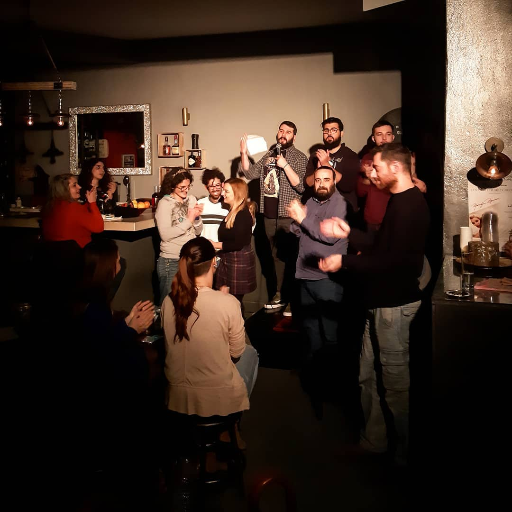

Open Mic Athens at the hospitable Akroasis of Kypseli. Known and unknown stand up comedians present their work.

Every Friday at 21:00
Contact: 2111822336 – 6907363999

*Information and Photo retrieved from:* [AKROASIS](https://akroasis.gr/open-mic-athens/)

## Art and Culture

**Megaron - The Athens Concert Hall**

The Athens Concert Hall offers a comprehensive range of facilities for all sorts of cultural activities, designed to the very highest specifications and one of the most impressive venues of its kind anywhere in the world. It offers a forum for all sorts of cultural activities – both artistic and educational.

*Information retrieved from:* [Megaron](http://www.megaron.gr/default.asp?la=2) |
*Photo retrieved form:* [EuGMS](https://www.eugms.org/2020/congress-venue.html)

**To Treno sto Rouf railway carriage theater**

The Railway Carriage Theater to Treno sto Rouf is  an innovative and integrated cultural venue. You can find to Treno sto Rouf at the platform of Rouf Railway Station. It consists of nine lovingly-restored old carriages, which are home to a theater stage, a music stage, a restaurant, a foyer, a bar, dressing rooms and utility rooms. The place plays host to theatrical, dance and music performances for children and adults, educational programmes, events, original entertainment, festivals, projects by young artists, exhibitions, screenings, lectures and romantic dinners and theme parties. The suggested duration is 2 to 3 hours.

*Information retrieved from:* [Trip Advisor](https://www.tripadvisor.com/) |
*Photo retrieved form:* [To Treno sto Rouf](https://totrenostorouf.gr/en/)

**Labrini Boviatsu - Exhibition "Ocean"**

The Skoufa Gallery presents the solo exhibition of Labrini Boviatsu entitled "Ocean" on Thursday, March 12 at 7:30 pm.
The starting point of the new Labrini Boviatsu solo exhibition is the examination of the emotion that first French writer Romen Rolland called "ocean emotion". It is a feeling of infinity and fullness that human existence feels for the purpose of embracing individuality and collective subjectivity. The ocean emotion, this transcendent experience and awareness of all, has been the source of studies by researchers in philosophy, psychoanalysis and anthropology.
Opening: Thursday 12 March 2020, 19.30
:ticket: Price: Free entry
:calendar: Date: 12 March 2020 - 4 April 2020

*Information and photo retrieved from:* [Art and Life](https://www.artandlife.gr/athens)

**Bernier Eliades**

A gallery right in the center of Athens. It was founded in 1977 in Athens and has since continued working in the field of contemporary art in Greece.
After twenty-one years in Kolonaki, the commercial center of Athens, the gallery moved to a Neoclassical building in Thission, the historic center of Athens.

During these years, Greek public has been introduced to numerous artistic currents, such as Arte Povera, Minimalism, Land and Conceptual Art and the younger generation of American and European artists.

*Information and photo retrieved from:* [Bernier Eliades](https://bernier-eliades.com/)

**Onassis Cultural Centre**

[Onassis Cultural Centre](https://www.onassis.org/onassis-stegi/) is a contemporary arts space with two high-spec performance halls, an open-air theatre, rooftop restaurant and a performance space. Numerous arts festivals are held here, which explore controversial issues and bold ideas. Theatre, dance, music, cinema, fine arts and literature are only some of the fields that this foundation explores.
Its internal space consists of 7 floors and 9 underground levels. During the summer, the building's terasse offers an amazing view to the Acropolis, the Lycabettus Hill and the Saronic Gulf.

*Information retrieved from:* [Harper's Bazaar](https://www.harpersbazaar.com/uk/travel/a28116013/athens-arts-culture-guide/) |
*Photo retrieved form:* [Google](https://www.google.com/search?q=onassis+cultural+center&sxsrf=ALeKk000HTD7ue1WpZh5sUSgwyT4k6zXGw:1583864295430&source=lnms&tbm=isch&sa=X&ved=2ahUKEwjo-82lwpDoAhWSN8AKHdXTCesQ_AUoAnoECCEQBA&biw=1366&bih=657#imgrc=5jC5E-VAR9H8sM/)

**Gazarte**

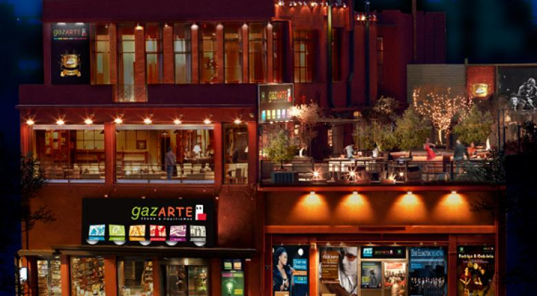

Gazarte is a multifaceted art and culture offering alternative entertainment and entertainment options to the visitor. Gazarte facilities include the Music Stage, Bookstore and Gazarte Cinema on the ground floor, the Cocktails Bar Restaurant with its Taratsa on the first floor, and the Multiple Events Room on the second floor.Located in Gazi's main square, next to Kerameikos Metro Station, Gazarte has a panoramic view of the Acropolis and Gazi, while being easy to access. For more information about its upcoming events you can check here:https://www.gazarte.gr/ 

*Information retrieved from:*[culturenow](https://www.culturenow.gr/venue/gazarte/) |
*Photo retieved form:*[Google](https://www.google.com/search?q=gazarte&sxsrf=ALeKk03opJykAs74FRA10bnwF7zuiVWrUA:1583887534546&source=lnms&tbm=isch&sa=X&ved=2ahUKEwjpg_HumJHoAhVWEncKHQhdBHcQ_AUoAnoECBcQBA&cshid=1583887677206282&biw=1536&bih=754#imgrc=3iG05n1s7R_7tM)

**Instar**

*12 March 2020 - 22 March 2020*

The new choreographic work of the dance group Proschima is presented in March for 8 performances. Maria Koliopoulou creates a duet for women's identity, interpreted by Ioanna Apostolou and Christina Ryanhart.

*Choreographer:* Maria Koliopoulou
*Artists:* Ioanna Apostolou, Christina Ryanhart

Tickets: 10€
Reservations - Info: 6909471254, from 11:00 - 14:00 & 17:00 - 20:00

*Information and photo are retrieved from:* [Art&Life](https://www.artandlife.gr/athens/events/instar_apo_tin_omada_sygxronoy_xoroy_prosxima)

**ADD 2020**

*29 May 2020 - 30 May 2020*

*Artists:* Alva Noto Live | Anetha | Apollonia | Charlotte de Witte | Cirkle | DISCOSODOMA Soundsystem | DJ Shadow Live | Eris Drew | FJAAK Live | Figkott | Floorplan | Honey Dijon | Jan Blomqvist Live | Kas:st Live | Kobosil | Massimiliano Pagliara |
Pantha Du Prince Live | Paula Temple | Rebekah | Volvox

ADD is the biggest tecnho music festival in Athens.

Tickets available at: www.addfestival.gr

*Information and photo are retrieved from:* [Art&Life](https://www.artandlife.gr/athens/events/add_2020)

## Accomodation

Explore Athens'most magical hotels and spas

**The Margi Hotel**

The Margi Hotel, is a boutique hotel, member of the <strong>Small Luxury Hotels of the World (SLH)</strong> and located in the heart of  most exclusive area of Athens Riviera, Vouliagmeni. It is located just a few minutes away from Vouiliagmeni's sandy beaches, but also close enough to some historical sites, like Cape Sounion. Its haute cuisine and organic food from its farm combined with its friendly and attentive staff, its spa premises and its exquisite design make The Margi Hotel a heaven away from home.

[You can discover more about The Margi Hotel and its amenities here](https://www.emst.gr/en/contact) 

*Information retrieved from:* [The Margi Hotel](https://www.themargi.gr/) |
*Photo retrieved form:* [The Margi Hotel](https://www.themargi.gr/gallery/the-pool/)

**Four Seasons Astir Palace Hotel Athens**

On the sophisticated Athens Riviera, at the tip of a pine-clad peninsula, Four Seasons offers the best of both worlds: a laid-back seaside escape just 30 minutes from the historical city centre. So, go on, discover the greek ancient civilization at the Acropolis, downtown, then return to Four Seasons to unwind, relax, enjoy a relaxing spa and an extraordinary gastronomical experience.

[You can discover more about The Four Seasons Astir Palace Hotel Athens and its amenities here](https://www.fourseasons.com/content/fourseasons/en/properties/athens/landing_pages/ppc/landing_3.html?gclid=Cj0KCQjw9ZzzBRCKARIsANwXaeJ9DBwlocegxdpvrMXxcfqbssBK-XFAxGUPqqEMssicxtaGP63RI70aAiiKEALw_wcB&source=gaw18APL01&ef_id=Cj0KCQjw9ZzzBRCKARIsANwXaeJ9DBwlocegxdpvrMXxcfqbssBK-XFAxGUPqqEMssicxtaGP63RI70aAiiKEALw_wcB:G:s&s_kwcid=AL!4732!3!419893037425!e!!g!!four%20seasons%20astir%20palace%20in%20athens) 

*Information retrieved from:* [Four Seasons Astir Palace Hotel Athens](https://www.fourseasons.com/content/fourseasons/en/properties/athens/landing_pages/ppc/landing_3.html?gclid=Cj0KCQjw9ZzzBRCKARIsANwXaeJ9DBwlocegxdpvrMXxcfqbssBK-XFAxGUPqqEMssicxtaGP63RI70aAiiKEALw_wcB&source=gaw18APL01&ef_id=Cj0KCQjw9ZzzBRCKARIsANwXaeJ9DBwlocegxdpvrMXxcfqbssBK-XFAxGUPqqEMssicxtaGP63RI70aAiiKEALw_wcB:G:s&s_kwcid=AL!4732!3!419893037425!e!!g!!four%20seasons%20astir%20palace%20in%20athens) |
*Photo retrieved form:* [Four Seasons Astir Palace Hotel Athens](https://www.fourseasons.com/content/fourseasons/en/properties/athens/landing_pages/ppc/landing_3.html?gclid=Cj0KCQjw9ZzzBRCKARIsANwXaeJ9DBwlocegxdpvrMXxcfqbssBK-XFAxGUPqqEMssicxtaGP63RI70aAiiKEALw_wcB&source=gaw18APL01&ef_id=Cj0KCQjw9ZzzBRCKARIsANwXaeJ9DBwlocegxdpvrMXxcfqbssBK-XFAxGUPqqEMssicxtaGP63RI70aAiiKEALw_wcB:G:s&s_kwcid=AL!4732!3!419893037425!e!!g!!four%20seasons%20astir%20palace%20in%20athens)

## Full Day Trips

If you are staying in Athens for a couple of days, it's worth making a day tripand discover a different part of Greece

**Port of Piraeus**

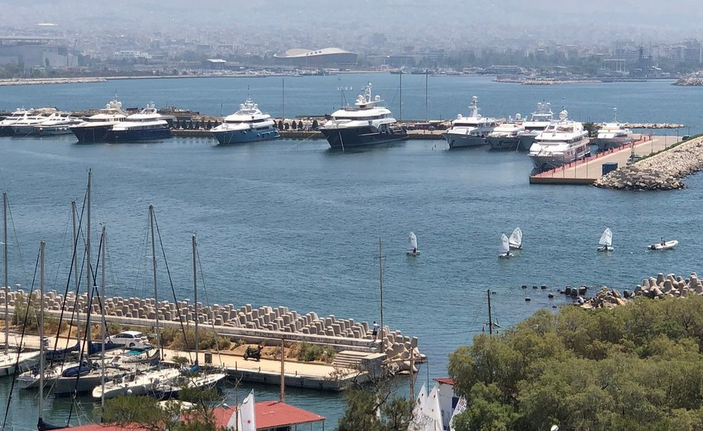

From the port of Piraeus you can take the ferries to the surrounding islands. A day trip to the surrounding islands is possible, because of the high number of ferries. The harbour is also close to the metro station Piraeus.
And as a student you also get some discounts.

*Information and photo are retrieved from:* [TripAdvisor](https://www.tripadvisor.de/Attraction_Review-g189403-d7974687-Reviews-Port_of_Piraeus-Piraeus_Piraeus_Region_Attica.html)

**Arachova**

Arachova is a traditional village close to Delphi, mostly known as a winter destination.

It gets very popular due to the [Ski Centre of Parnassos](https://parnassos-ski.gr/) that is found in close distance from the town. It is also a town with a rich historical background and beautiful nature surrounding it. Not only the town itself has nice architecture, but the surrounding region is also nice for sightseeing. Apart from the close site of Ancient Delphi, other interesting sights in short drive from Arachova are the Byzantine Monastery of Osios Loukas and the seaside towns of Itea and Galaxidi.

*Information retrieved form:* [greeka](https://www.greeka.com/sterea/arachova/sightseeing/) | *Photo retrieved form:* [Visit Greece](http://www.visitgreece.gr/el/mainland/arachova)

**Ski Centre of Parnassos**

Speaking of the exotic place of Arachova and, specifically, for Mountain Parnassos, it is a hell of a must-do trip if you are on to an amazing experience. Parnassos is one of the most beautiful mountains in Greece and comes with an amazing sport, skiing. The ski center has 23 tracks, 7 ski runs and 7 trails, totaling approximately 34 kilometers. The slopes are from 50m up to 4 km for beginners, intermediate and advanced skiers. For adventure lovers, there are 12 off-track "black" tracks with really deep snow and a lot of adrenaline.

Be careful though, skiing is an amazing sport giving you the feeling of freedom but requires attention and proper equipment.

*Information retrieved form:* [Parnassos Ski Centre](https://parnassos-ski.gr/%CF%84%CE%BF-%CF%87-%CE%BA-%CF%80%CE%B1%CF%81%CE%BD%CE%B1%CF%83%CF%83%CE%BF%CF%8D/) | *Photo retrieved form:* [Google](https://www.google.com/search?q=ski+centre+parnassos&sxsrf=ALeKk00PRj33B1E_ExNuItBmZAXj-ZTIVw:1583865690639&source=lnms&tbm=isch&sa=X&ved=2ahUKEwie5PK-x5DoAhWhsKQKHct8DfwQ_AUoAnoECBoQBA&biw=1366&bih=657#imgrc=ceEMpv45b-ztkM)

**Mycenae, Epidaurus, and Nafplio**

Do you know which is the city of mythical Agamemnon, the hero of Trojan war? Which was one of the most important healing places in ancient times? Which is considered to be the most perfect ancient Greek theatre with regard to acoustics and aesthetic?
All those questions can be answered through this amazing day trip to Peloponnese which will offer the visitor the chance to discover some of the most important archaelogical sites of Greece, like Mycenae and Epidaurus.

*Information and photo retrieved from:* [travelpassionate](https://travelpassionate.com/top-day-trips-from-athens-greece/)

**Spetses**

Spetses is one of the most cosmopolitan and picturesque islands in Greece. Located in the Saronic Gulf, just two hours away from Athens, Spetses is far enough to escape the crowds of the capital and close enough for a relaxing trip. The charming atmosphere of this island has inspired many artists and writers. As the hydrofoil approaches the port, the first thing you’ll see is the tall Venetian mansions that surround the port and some cannons. These cannons used to protect the island in times of war and pirate attacks. Spetses played an important role during the Greek War of Independence, as it helped the Greeks with ships and guns. The most famous war hero from Spetses is a woman, Lascarina Bouboulina, who played a leading part in sea battles and sieges of castles. Activities on Spetses are mostly concentrated around Dapia, the new port. The old port is located on the other side of the town. As this is the only village on the island, Spetses Town has all the facilities needed for a comfortable stay. Vehicles are prohibited in the town, except for bicycles and motorbikes. Transportation is done by boat, bus or bicycle.  

*Information retrieved from:* [Greeka](https://www.greeka.com/attica/athens/tours/t07b-one-day-tour-to-spetses-island/) |
*Photo retrieved from:* [Greece-is](https://www.greece-is.com/wp-content/uploads/2016/08/SPETSES_YannisLarios_Spetses_IMG_1008.jpg)

**Chalkida**

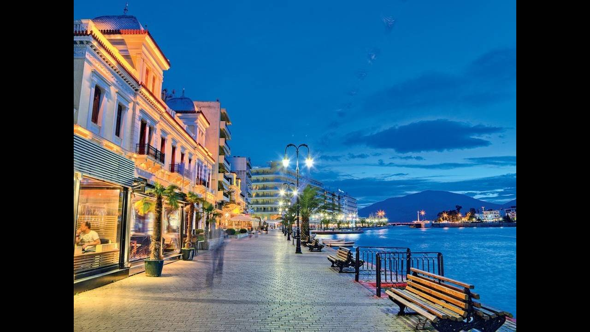

One hour from Athens, you can visit the beautiful city of Chalkida. Ouza taverns and snacks for Sunday excursions, beautiful beaches to the north and south with clear waters and sandy beaches and a sense that the city lives on a permanent holiday.From the Negreponte bridge you can watch the changing direction of the waters of Euripos every six hours, a classic family attraction of the 1970s. Moreover, you can see the Roman aqueduct, known as the Arches, with twelve arches.

*Information retrieved from:* [athinorama](https://www.athinorama.gr/travel/greece/destination.aspx?did=497&aid=710065) |
*Photo retrieved from:* [Google](https://www.google.com/search?q=%CF%87%CE%B1%CE%BB%CE%BA%CE%B9%CE%B4%CE%B1&sxsrf=ALeKk00Ogy_GeAD3vkLw_gla5-F9UsXPkQ:1583886666903&source=lnms&tbm=isch&sa=X&ved=2ahUKEwiXsZTRlZHoAhUHxosKHaxmBskQ_AUoAnoECBsQBA&biw=1536&bih=754#imgrc=AgJ_EeDOEdyNAM)

**Full Day Cruise to Greek Islands from Athens: Poros - Hydra - Aegina**

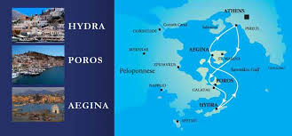

With this cruise you can visit three of the islands in Greece’s Saronic Gulf in turn, in just a day. Stroll on Hydra, visit Paros, and spend time on Aegina, either exploring alone or touring its Temple of Aphaia. Escpecially, on summer days it will make the day perfect and totally worth it. At the end of the day, you may be tired, but you still can do a lot of things. Look every other section of this guide to help you find the perfect place for you after a long and tiring day!

*Information retrieved from:*[Trip Advisor](https://www.tripadvisor.com/AttractionProductReview-g3695532-d13857583-Full_Day_Cruise_to_Greek_Islands_from_Athens_Poros_Hydra_Aegina-Paleo_Faliro_Atti.html)
*Image retrieved from:*[Ferries](https://www.ferries.gr/)
>>>>>>> 642027c4f324b77cc59ec36958da6d2355b497d2

## Beach

Athens is well known for its beatiful sun and weather, so if you are visiting Athens in summer time, here are some beaches you can visit!

**Karavi Schinias**

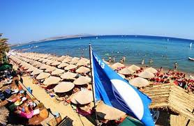

One of the best and famous beaches in Athens is Schinias. It is a really beautiful place and the waters are crystal clear. Karavi is a beach bar in Schinias beach that elevates the customers' experience! It offers plenty of things to the customer. First of all, you can enjoy your beverage or food in your sunbed. Then, there are a lot of beach volley courts  and if you are lucky enough you can watch professional tournaments that take place there. Last but not least, there are a lot of water sports that one can do there. So as you can see there are lot of ways to enjoy your time there. The only disadvantage of this place is that it is only accessible by car, since it is far enough from metro stations, bus stops etc. But don't let that prevent from enjoying a beautiful sunny day in summer gets wasted.

*Information and photo retrieved from:* [Trip Advisor](https://www.tripadvisor.com.gr/Attraction_Review-g669631-d6586221-Reviews-Karavi_Schinias_Water_Sports-Marathon_East_Attica_Region_Attica.html)

**Limanakia Vouliagmenis**

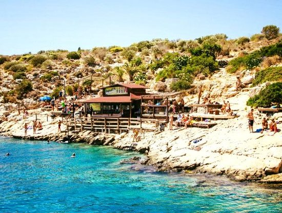

A series of many small beaches in small natural bays with rocks that impress with their natural beauty and wild charm of the landscape spreads in Vouliagmeni, on the way to Varkiza. The turquoise cool waters are accessible by descending paths between the rocks.

*Information retrieved from:* [trip2athens](https://www.trip2athens.com/el/see-n-do/attractions/beaches/attraction-222/#tab-2) |
*Photo retrieved from:* [Google](https://www.google.com/search?q=%CE%BB%CE%B9%CE%BC%CE%B1%CE%BD%CE%B1%CE%BA%CE%B9%CE%B1+%CE%B2%CE%BF%CF%85%CE%BB%CE%B9%CE%B1%CE%B3%CE%BC%CE%B5%CE%BD%CE%B7&sxsrf=ALeKk01VEWR9YSxs9sGtJ_XgJqRgETe6Nw:1583883741445&source=lnms&tbm=isch&sa=X&ved=2ahUKEwj5zZjeipHoAhVRxMQBHbt9DD0Q_AUoAXoECBMQAw&biw=1536&bih=754&dpr=1.25#imgrc=pQC-YGWv8PCPPM)
